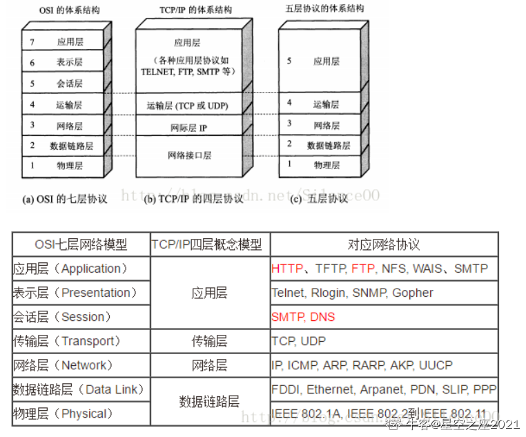
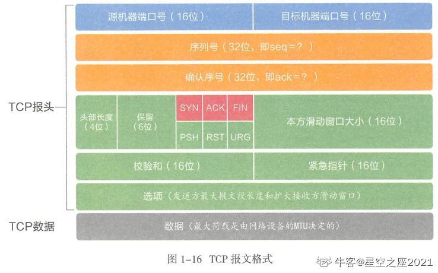
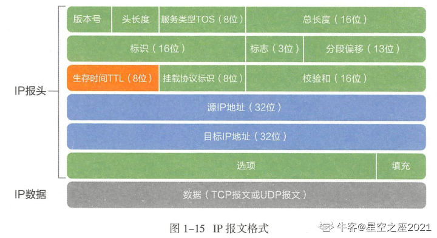
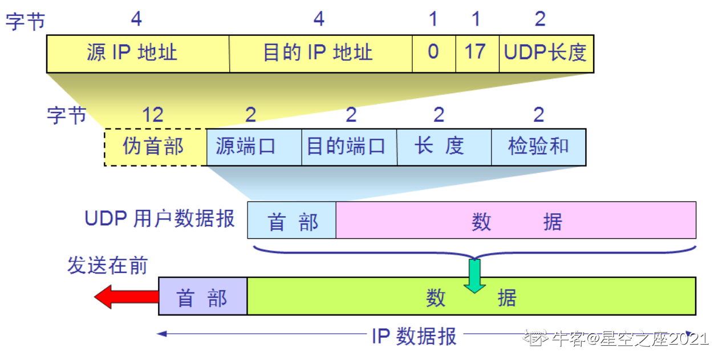
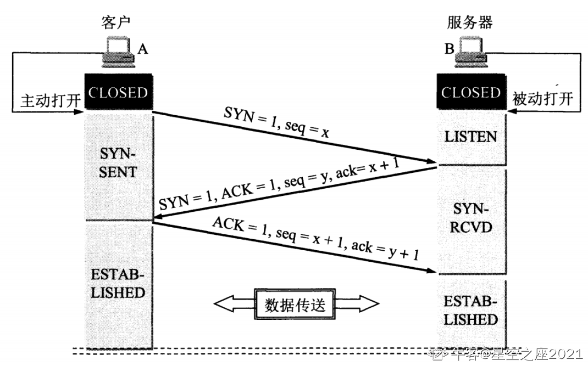
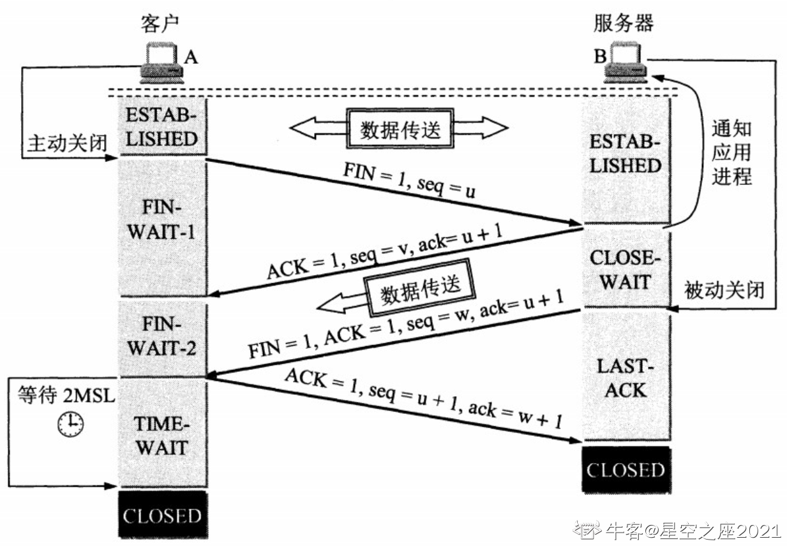
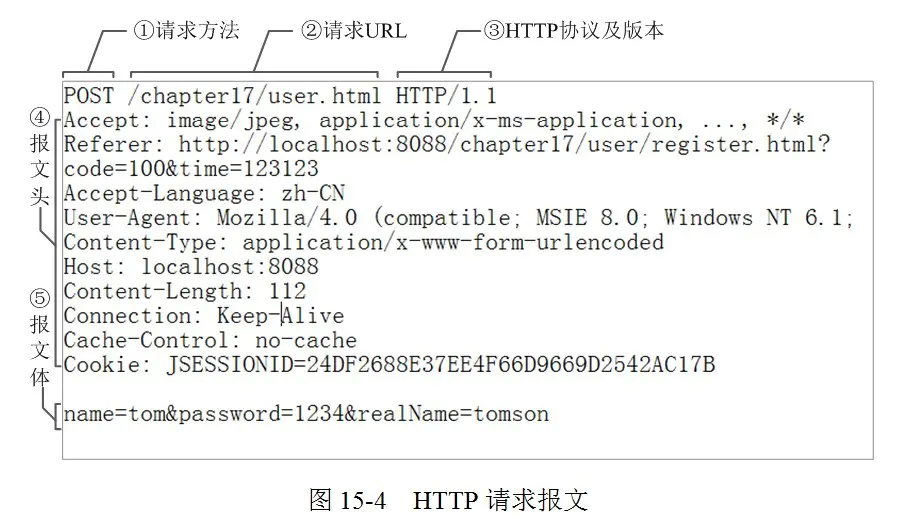
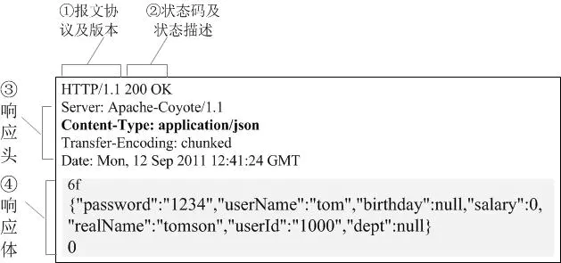

# Computer NetWorking [https://www.nowcoder.com/discuss/807702?type=all&order=recall&pos=&page=1&ncTraceId=&channel=-1&source_id=search_all_nctrack&gio_id=16EF4836BF8A0F8925F3F9D91FA730E0-1638289718121]

[TOC]

## General:

##### OSI七层协议模型、TCP/IP四层模型和五层协议体系结构之间的关系？

# 

##### OSI为什么有了七层还有五层的概念

- 七层协议的理论虽然完整，但是不太实用而且很复杂
- 四层结构是实现模型，而5层结构则是结合两种模型得出的，目的是为了更好描述网络接口层


### Application Layer 应用层

#### HTTP


### Presentation Layer  表示层


### Session Layer 会话层


### Transport Layer 传输层

#### TCP

##### TCP报文格式及首部含义？



16位端口号：

​	端口号：用来标识同一台计算机的不同的应用进程

- 16位 源端口号： 主机该报文段是来自哪里
- 16位 目标端口号： 要传给哪个上层协议或应用程序

​	TCP报头中的源端口号和目的端口号同IP数据报中的源IP与目的IP唯一确定一条TCP连接

32位 序号和确认号：

​	序号时本报文段发送数据组的第一个字节的序号。在TCP传送的流中，每一个字节一个序号。

序号，SEQ，确定了TCP传输的有序性

确认号，ACK，指明下一个期待收到的字节序号，表明序号之前的所有数据已经正确无误的收到。确认号只有当ACK标志为1时才有效。比如建立连接时，SYN报文的ACK标志位为0

**32位序号**：一次TCP通信（从TCP连接建立到断开）过程中某一个传输方向上的字节流的每个字节的编号。

**32位确认号**：用作对另一方发送的tcp报文段的响应。其值是收到的TCP报文段的序号值加1。


**首部长度**：表示tcp头部有多少个32bit字（4字节）4bits。由于首部可能含有可选项内容，因此TCP报头的长度是不确定的，报头不包含任何任选字段则长度为20字节，4位首部长度字段所能表示的最大值为1111，转化为10进制为15，15*32/8 = 60，故报头最大长度为60字节。首部长度也叫数据偏移，是因为首部长度实际上指示了数据区在报文段中的起始偏移值。

**6位标志位**：

- URG(紧急指针是否有效)，
- ACk（表示确认号是否有效），
- PSH（缓冲区尚未填满），
- RST（表示要求对方重新建立连接），
- SYN（建立连接消息标志接），
- FIN（表示告知对方本端要关闭连接了）

**16位窗口大小**：是TCP流量控制的一个手段。这里说的窗口，指的是接收通告窗口。它告诉对方本端的TCP接收缓冲区还能容纳多少字节的数据，这样对方就可以控制发送数据的速度。

**16位校验和**：由发送端填充，接收端对TCP报文段执行CRC算法以检验TCP报文段在传输过程中是否损坏。注意，这个校验不仅包括TCP头部，也包括数据部分。这也是TCP可靠传输的一个重要保障。

1**6位紧急指针**：一个正的偏移量。它和序号字段的值相加表示最后一个紧急数据的下一字节的序号。因此，确切地说，这个字段是紧急指针相对当前序号的偏移，不妨称之为紧急偏移。TCP的紧急指针是发送端向接收端发送紧急数据的方法。

头部长度：通常为20字节，有选项时更长 

-  这里头部长度的1指代的是32位，即4个字节长度 
-  因此4位的首部长度能够表示60字节 

 报文序号 

-  标识报文中的第一个数据字节的序号 
-  到达2^32-1后，重新回到0开始计数 
-  初始连接请求报文中，SYN标志位也占1，因此第一字节序号为ISN+1 

 确认序号 

-  接收方期望接收的下一个数据字节的序号 
-  ACK为1时有效 

 校验和 

-  由首部和数据一起运算得到，用来校验报文数据是否丢失 

 紧急指针 

-  紧急数据字节号(urgSeq)=TCP报文序号(seq)+紧急指针(urgpoint)−1 
-  正偏移量 

 选项 

-  常见的是MSS(最大报文大小)，指明本端能够接收的最大长度的报文段 

 窗口大小 ： 滑动窗口大小，用来告知发送端接受端的缓存大小，以此控制发送端发送数据的速率，从而达到流量控制。窗口大小时一个16bit字段，因而窗口大小最大为65535。

-  16位的窗口大小最多能放65536字节 
-  如果想要使用更大的窗口，可以在选项中添加窗口的缩放比例因子来进行扩大，比例为0-14

#### UDP


### Network Layer 网络层

#### IP

##### IP报文格式及首部含义



头部长度：通常20字节，有选项时更长，总共不超过60字节 

 校验和    

-  仅对IP首部计算校验和 
-  TCP、UDP、ICMP等协议均在各自的首部中包含覆盖首部和数据的校验和 

 挂载协议标识    

-  用来表示上层的传输层协议使用的是什么协议 

 分段偏移    

-  当原始报文过大，以以太网帧为例，当大于1500字节的时候，会对原始报文进行分割，此时该字段就用来表示该分段在原始报文的位置


### Data Link 数据链路层


### Physical 物理层


##### 3. UDP报文格式及首部含义



- 主要组成：源端口号、目标端口号、报文长度、检验和，一共8字节
- 报文长度
  - 指首部和数据的总字节长度

UDP伪首部作用？

伪首部的出现：发送方或接收方根据IP报文首部获得8字节的源地址+目的地址、2字节的0字段+UDP协议字段、2字节的数据长度，得到12字节伪首部，临时添加在首部前面 

 伪首部的消失：发送方将计算完毕的校验和填入首部的校验和字段后，去除伪首部发送UDP报文 

 作用：仅仅是为了计算校验和


##### 4. TCP三次握手的流程？



假设 A 为客户端，B 为服务器端。    

-  首先 B 处于 LISTEN（监听）状态，等待客户的连接请求。 
-  A 向 B 发送连接请求报文，SYN=1，选择一个初始的序号 x。      
  -  在SYN建立连接的阶段会携带MSS选项字段来决定MSS报文的大小 
  -  默认是536字节，如果双方协商不成功 
-  B 收到连接请求报文，如果同意建立连接，则向 A 发送连接确认报文，SYN=1，ACK=1，确认号为 x+1，同时也选择一个初始的序号 y。 
-  与此同时，B会将该连接放进半连接队列（SYN队列） 
-  A 收到 B 的连接确认报文后，还要向 B 发出确认，确认号为 y+1，序号为 x+1。 
-  此时A已经可以携带数据 
-  B 收到 A 的确认后，连接建立。 
-  此时，B的内核会将该连接从半连接队列中移除，然后创建新的完全连接，并添加到accept队列（全连接队列），等待应用程序调用accept函数取出来


##### 5. 为什么需要三次握手？

防止历史连接请求初始化了连接    

- 第三次握手是为了防止失效的连接请求到达服务器，让服务器错误打开连接。 

- 客户端发送的连接请求如果在网络中滞留，那么就会隔很长一段时间才能收到服务器端发回的连接确认。客户端等待一个超时重传时间之后，就会重新请求连接。但是这个滞留的连接请求最后还是会到达服务器：

  ​	如果不进行三次握手，那么服务器就会打开两个连接。

  如果有第三次握手，客户端会根据上下文（如确认号）判断服务端发来的确认连接是否是历史连接（此时客户端不处于SYN-SENT状态），如果是，客户端则发送RST报文，终止历史连接，避免错误打开连接。 

 同步双方初始序列号

-  在TCP协议中，报文的序列号和确认号是确保消息可靠送达的重要机制 
-  因此，需要正确同步双方的初始序列号。而同步一方的初始序列号，需要一次请求报文和响应报文。因此，确认双方的初始序列号，需要进行三次握手 
-  当客户端发送携带「初始序列号」的 SYN 报文的时候，需要服务端回一个 ACK 应答报文，表示客户端的 SYN 报文已被服务端成功接收，那当服务端发送「初始序列号」给客户端的时候，依然也要得到客户端的应答回应，这样一来一回，才能确保双方的初始序列号能被可靠的同步 

 避免资源浪费

-  与第一点相似，主要是为了避免重开连接导致浪费系统资源

##### 6. 三次握手过程中未收到对方回复会怎么样？

服务端未收到第一次握手信息    

-  服务端本身不会干什么，因为它还没有收到连接请求 
-  客户端会不断地重试发送 

 客户端没有收到第二次握手信息    

-  服务端的响应由于网络原因一直没有抵达客户端，此时服务端会不断重试 

 服务端没有收到第三次握手信息    

-  服务端没有收到客户端的确认信息，这时候服务端会重传报文，如果重传次数达到上限时仍然没有收到确认报文，那么accept会返回-1，此时服务端这边的连接建立失败 
-  此时客户端已经进入连接状态，可以发送消息了，但是服务端的连接失败了(accept返回-1)，此时客户端再向服务端发送数据，服务端在收到后会发送RST报文给客户端


##### 7. 如何绕过三次握手？

- 在普通的三次握手的流程中，头两次握手的期间是不能携带数据的
- 也就是必须等到一个RTT时间后才能发送数据
- 使用TCP Fast Open，可以减少TCP建立连接发送数据的延迟

在客户端首次建立连接时的过程： 

1.  客户端发送 SYN 报文，该报文包含 Fast Open 选项，且该选项的 Cookie 为空，这表明客户端请求 Fast Open Cookie； 
2.  支持 TCP Fast Open 的服务器生成 Cookie，并将其置于 SYN-ACK 数据包中的 Fast Open 选项以发回客户端； 
3.  客户端收到 SYN-ACK 后，本地缓存 Fast Open 选项中的 Cookie。 

 所以，第一次发起 HTTP GET 请求的时候，还是需要正常的三次握手流程。 

 之后，如果客户端再次向服务器建立连接时的过程： 

1.  客户端发送 SYN 报文，该报文包含「数据」（对于非 TFO 的普通 TCP 握手过程，SYN 报文中不包含「数据」）以及此前记录的 Cookie； 
2.  支持 TCP Fast Open 的服务器会对收到 Cookie 进行校验：如果 Cookie 有效，服务器将在 SYN-ACK 报文中对 SYN 和「数据」进行确认，服务器随后将「数据」递送至相应的应用程序；如果 Cookie 无效，服务器将丢弃 SYN 报文中包含的「数据」，且其随后发出的 SYN-ACK 报文将只确认 SYN 的对应序列号； 
3.  如果服务器接受了 SYN 报文中的「数据」，服务器可在握手完成之前发送「数据」，这就减少了握手带来的 1 个 RTT 的时间消耗； 
4.  客户端将发送 ACK 确认服务器发回的 SYN 以及「数据」，但如果客户端在初始的 SYN 报文中发送的「数据」没有被确认，则客户端将重新发送「数据」； 
5.  此后的 TCP 连接的数据传输过程和非 TFO 的正常情况一致。 

 所以，之后发起 HTTP GET 请求的时候，可以绕过三次握手，这就减少了握手带来的 1 个 RTT 的时间消耗。


##### 8. 初始序列号 ISN 是如何随机产生的？

起始 ISN 是基于时钟的，每 4 毫秒 + 1，转一圈要 4.55 个小时。 

 RFC1948 中提出了一个较好的初始化序列号 ISN 随机生成[算法]()。 

 *ISN = M + F (localhost, localport, remotehost, remoteport)* 

-  M 是一个计时器，这个计时器每隔 4 毫秒加 1。 
-  F 是一个 Hash [算法]()，根据源 IP、目的 IP、源端口、目的端口生成一个随机数值。要保证 Hash [算法]()不能被外部轻易推算得出，用 MD5 [算法]()是一个比较好的选择


##### 9. 既然 IP 层会分片，为什么 TCP 层还需要 MSS 呢？

- MTU：一个网络包的最大长度，以太网中一般为 1500 字节；
- MSS：除去 IP 和 TCP 头部之后，一个网络包所能容纳的 TCP 数据的最大长度；
- 假设TCP的报文均由IP层进行分片；
- 当TCP的报文长度大于MTU时，报文会进行分片，然后发送给目标主机，再由目标主机进行组装，上传到传输层
- 然而，如果有一个IP分片丢失了，那么整个IP报文需要重传
- 因为IP层本身无超时重传机制，超时重传机制是靠传输层的TCP来保证的；
- 当接收方发现TCP报文中的一片丢失后，不会响应对应报文的ACK给对方，发送方在超时后就会重发TCP报
- 到达IP层后则需再次分片发送，效率低下 
- 针对上述情况，为了达到最佳的传输性能，TCP 协议在建立连接的时候通常要协商双方的 MSS 值，当 TCP 层发现数据超过 MSS 时，则就先会进行分片，当然由它形成的 IP 包的长度也就不会大于 MTU ，自然也就不用 IP 分片了
- 经过 TCP 层分片后，如果一个 TCP 分片丢失后，进行重发时也是以 MSS 为单位，而不用重传所有的分片，大大增加了重传的效率。


##### 10 SYN攻击是什么？

TCP 连接建立是需要三次握手，假设攻击者短时间伪造不同 IP 地址的 SYN 报文，服务端每接收到一个 SYN 报文，就进入SYN_RCVD 状态，但服务端发送出去的 ACK + SYN 报文，无法得到未知 IP 主机的 ACK 应答，久而久之就会占满服务端的 SYN 接收队列（未连接队列），使得服务器不能为正常用户服务 

 一旦服务端接收到SYN后，会为该连接分配一个TCB（Transmission Control Block），通常一个TCB至少需要280个字节，在某些操作系统中TCB甚至需要1300个字节 

 半连接队列的个数一般是有限的，在SYN攻击下，服务器会打开大量的半连接，分配TCB，从而耗尽服务器的资源，使得正常的连接请求无法得到响应

SYN攻击的分类有哪些？

- Direct Attack 直接攻击    
  -  攻击方使用固定的源地址发起攻击 
  -  这种比较容易预防，只要将特定的IP列入黑名单即可 

- Spoofing Attack 攻击方使用变化的源地址发起攻击 

- Distributed Direct Attack 这种攻击主要是使用僵尸网络进行固定源地址的攻击

SYN攻击的解决方法有什么？

主要针对后两种攻击

	- 修改Linux 内核参数，控制队列大小和当队列满时应做什么处理
	- 开启 tcp_syncookies 功能
 - 增大半连接队列
   	- 增大半连接队列，我们得知不能只单纯增大 tcp_max_syn_backlog 的值，还需一同增大 somaxconn 和 backlog，也就是增大全连接队列
   - `sysctl -w net.ipv4.tcp_max_syn_backlog=2048`
- 减少 SYN+ACK 重传次数
- 全连接队列和半连接队列一起构成未决连接队列，这个队列的大小为backlog，是listen的参数

SYN cookie是什么？

- 服务器端根据本次连接的信息、时间生成一个SYN cookie做为报文初始序号 
- 当客户端收到后，会向服务端发送响应报文 
- 服务端根据响应报文的确认号-1就可以得到之前的SYN cookie 
- 对SYN cookie按照规则进行解析就可以判断响应是否超时，以及连接信息是否有伪装等，避免浪费服务器的资源


##### 11. TCP控制位有哪些？分别有什么用？

SYN(synchronous建立联机)    

-  用于建立连接，该报文的序列号用于初始序号的确定 

 ACK(acknowledgement 确认)    

-  表示当前报文的应答字段有效 
-  除了最初的SYN报文外，其它报文必须将该位设置为1 

 PSH(push传送)    

-  接收方应该尽快将报文提交给应用层 
-  为0则可以先进行缓存 

 FIN(finish结束)    

-  表示今后不会再有数据发送，希望断开连接 
-  通信结束后，双方交换fin报文结束通信 

 RST(reset重置)    

-  TCP连接出现异常，必须强制断开连接 
-  常见情况：连接请求到达时，目标端口没有进程在监听 

 URG(urgent紧急)    

-  表示包中有需要紧急处理的数据，结合紧急指针一起使用 

 Sequence number(顺序号码)    

-  对字节流进行标号，表示第一个字节的编号 

 Acknowledge number(确认号码)    

-  期望收到的下一个报文的序号

##### 12. TCP首部格式以及字段含义？

序号：

-  用于对字节流进行编号。例如序号为 301，表示第一个字节的编号为 301，如果携带的数据长度为 100字节，那么下一个报文段的序号应为 401。 

确认号 ：

-  期望收到的下一个报文段的序号。例如 B 正确收到 A 发送来的一个报文段，序号为 501，携带的数据长度为 200 字节，因此 B 期望下一个报文段的序号为 701，B 发送给 A 的确认报文段中确认号就为 701。 

数据偏移 ：

-  指的是数据部分距离报文段起始处的偏移量，实际上指的是首部的长度。 

确认 ACK ：

-  当 ACK=1 时确认号字段有效，否则无效。TCP 规定，在连接建立后所有传送的报文段都必须把ACK 置 1 

同步 SYN ：

-  在连接建立时用来同步序号。当 SYN=1，ACK=0 时表示这是一个连接请求报文段。若对方同意建立连接，则响应报文中 SYN=1，ACK=1。 

终止 FIN ：

-  用来释放一个连接，当 FIN=1 时，表示此报文段的发送方的数据已发送完毕，并要求释放连接。 

窗口 ：

-  窗口值作为接收方让发送方设置其发送窗口的依据。之所以要有这个限制，是因为接收方的数据缓存空间是有限的。


##### 13. 四次挥手的流程？




以下描述不讨论序号和确认号，因为序号和确认号的规则比较简单。并且不讨论 ACK，因为 ACK 在连接建立之后都为 1。 

-  A 发送连接释放报文，FIN=1。 
-  B 收到之后发出确认，此时 TCP 属于半关闭状态，B 能向 A 发送数据但是 A 不能向 B 发送数据。 
-  当 B 不再需要连接时，发送连接释放报文，FIN=1。 
-  A 收到后发出确认，进入 TIME-WAIT 状态，等待 2 MSL（最大报文存活时间）（Linux 系统里 2MSL 默认是 60 秒）后释放连接。 
-  B 收到 A 的确认后释放连接。

##### 14. 为什么需要4次挥手？

客户端发送了 FIN 连接释放报文之后，服务器收到了这个报文，就进入了 CLOSE-WAIT 状态。这个状态是为了让服务器端发送还未传送完毕的数据，传送完毕之后，服务器会发送 FIN 连接释放报文。 TIME_WAIT 客户端接收到服务器端的 FIN 报文后进入此状态，此时并不是直接进入 CLOSED 状态，还需要等待一个时间计时器设置的时间 2MSL。这么做有两个理由： 

-  确保最后一个确认报文能够到达。如果 B 没收到 A 发送来的确认报文，那么就会重新发送连接释放请求报文，A 等待一段时间就是为了处理这种情况的发生。 
-  至少允许报文丢失一次 
-  等待一段时间是为了让本连接持续时间内所产生的所有报文都从网络中消失，使得下一个新的连接不会出现旧的连接请求报文。 


##### 15. 四次挥手可以变为三次吗

- 一种情况时延迟确认，将第二步的ack与第三步的fin包一起发送给对端
- 另外一种是服务端已经没有什么数据要发送了，就可以将fin和ack合并一个包发送给对端


##### 16. FIN-WAIT2等待时间是多少？

主动关闭的一端调用完close以后（即发FIN给被动关闭的一端， 并且收到其对FIN的确认ACK）则进入FIN_WAIT_2状态。如果这个时候因为网络突然断掉、被动关闭的一段宕机等原因，导致主动关闭的一端不能收到被动关闭的一端发来的FIN（防止对端不发送关闭连接的FIN包给本端），这个时候就需要FIN_WAIT_2定时器， 如果在该定时器超时的时候，还是没收到被动关闭一端发来的FIN，那么直接释放这个链接，进入CLOSE状态


##### 17. 针对 TCP 应该如何 Socket 编程？

流程： 

 服务端和客户端初始化 socket，得到文件描述符； 

 服务端调用 bind，将监听socket绑定在 IP 地址和端口; 

 服务端调用 listen，进行监听； 

 服务端调用 accept，等待客户端连接； 

 客户端调用 connect，向服务器端的地址和端口发起连接请求； 

 服务端 accept 返回用于传输的 socket 的文件描述符； 

 客户端调用 write 写入数据；服务端调用 read 读取数据； 

 客户端断开连接时，会调用 close，那么服务端 read 读取数据的时候，就会读取到了 EOF，待处理完数据后，服务端调用 close，表示连接关闭。


##### 18.  HTTP协议和HTTPS协议的默认端口号？

- http:80
- https:443


##### 19. http协议的流程？

1. 首先进行域名解析。 
2. 浏览器发起HTTP请求。 
3. 接下来到了传输层，选择传输协议。TCP或者UDP，TCP是可靠的传输控制协议，对HTTP请求进行封装，加入了端口号等信息。 
4. 然后到了网络层，通过IP协议将IP地址封装为IP数据报；然后此时会用到ARP协议，主机发送信息时将包含目标IP地址的ARP请求广播到网络上的所有主机，并接收返回消息，以此确定目标的物理地址，找到目的[MAC](https://www.baidu.com/s?wd=MAC&tn=24004469_oem_dg&rsv_dl=gh_pl_sl_csd)地址； 
5.  接下来到了数据链路层，把网络层交下来的IP数据报添加首部和尾部，封装为MAC帧，现在根据目的mac开始建立TCP连接，三次握手，接收端在收到物理层上交的比特流后，根据首尾的标记，识别帧的开始和结束，将中间的数据部分上交给网络层，然后层层向上传递到应用层； 
6. 服务器响应请求并返回客户端要的资源，传回给客户端； 
7.  断开TCP连接，浏览器对页面进行渲染呈现给客户端。

##### 20. cookies和session的含义与区别？

Cookie ：    

-  Cookie 是服务器发送到用户浏览器并保存在本地的一小块数据，它会在浏览器之后向同一服务器再次发起请求时被携带上，用于告知服务端两个请求是否来自同一浏览器。由于之后每次请求都会需要携带 Cookie 数据，因此会带来额外的性能开销（尤其是在移动环境下）。 
-  用途：      
  -  会话状态管理（如用户登录状态、购物车、游戏分数或其它需要记录的信息） 
  -  个性化设置（如用户自定义设置、主题等） 
  -  浏览器行为跟踪（如跟踪分析用户行为等）

Session ：    

-  Session 是存储在 web 服务器端的一块信息。 session 对象存储特定用户会话所需的属性及配置信息。当用户在应用程序的 Web 页之间跳转时，存储在 Session 对象中的变量将不会丢失，而是在整个用户会话中一直存在下去。

不同：    

-  **存取方式的不同：**Cookie 只能存储 ASCII 码字符串，而 Session 则可以存储任何类型的数据，因此在考虑数据复杂性时首选Session； 
-  **隐私策略的不同：**Cookie 存储在浏览器中，容易被恶意查看。如果非要将一些隐私数据存在 Cookie 中，可以将 Cookie 值进行加密，然后在服务器进行解密。而Session存储在服务器上，不存在敏感信息泄露的风险。 
-  **服务器压力的不同：**对于大型网站，如果用户所有的信息都存储在 Session 中，那么开销是非常大的，因此不建议将所有的用户信息都存储到 Session 中。 而Cookie保管在客户端，不占用服务器资源。假如并发阅读的用户十分多，Cookie是很好的选择。关于Google、Baidu、Sina来说，Cookie或许是唯一的选择。 
-  **浏览器支持的不同：**无论客户端做怎样的设置， session 都能够正常工作。当客户端禁用 cookie 时将无法使用 cookie。 假如客户端浏览器不支持Cookie，需要运用Session以及URL地址重写。需要注意的是一切的用到Session程序的URL都要进行URL地址重写，否则Session会话跟踪还会失效。关于WAP应用来说，Session+URL地址重写或许是它唯一的选择 
-  **跨域支持上的不同：**Cookie支持跨域名访问，例如将domain属性设置为“.biaodianfu.com”，则以“.biaodianfu.com”为后缀的一切域名均能够访问该Cookie。跨域名Cookie如今被普遍用在网络中，例如Google、Baidu、Sina等。而Session则不会支持跨域名访问。Session仅在他所在的域名内有效。

##### 21.  Http协议如何保证安全性？

1. 重要的数据，要加密

   ：    

   -  比如用户名密码，我们需要加密，这样即使被抓包监听，他们也不知道原始数据是什么。 

2. 非重要数据，要签名

   ：    

   -  签名的目的是为了防止篡改，比如http://www.xxx.com/getnews?id=1，获取id为1的新闻，如果不签名那么通过id=2,就可以获取2的内容等等。怎样签名呢？通常使用sign，比如原链接请求的时候加一个sign参数，sign=md5(id=1)，服务器接受到请求，验证sign是否等于md5(id=1)，如果等于说明正常请求。这会有个弊端，假如规则被发现，那么就会被伪造，所以适当复杂一些，还是能够提高安全性的。 


##### 22. 阻塞式io和非阻塞式io有什么区别？

读：    

-  在阻塞条件下，如果没有发现数据在网络缓冲中会一直等待，当发现有数据的时候会把数据读到用户指定的缓冲区。但是如果这个时候读到的数据量比较少，比参数中指定的长度要小，read并不会一直等待下去，而是立刻返回。read的原则是数据在不超过指定的长度的时候有多少读多少，没有数据就会一直等待。所以一般情况下我们读取数据都需要采用循环读的方式读取数据，一次read完毕不能保证读到我们需要长度的数据，read完一次需要判断读到的数据长度再决定是否还需要再次读取。 
-  **在非阻塞的情况下，**read的行为是如果发现没有数据就直接返回，如果发现有数据那么也是采用有多少读多少的进行处理．对于读而言，阻塞和非阻塞的区别在于没有数据到达的时候是否立刻返回。 

 写：    

-  **在阻塞的情况，**是会一直等待直到write完全部的数据再返回。 
-  非阻塞写的情况，是采用可以写多少就写多少的策略。与读不一样的地方在于，有多少读多少是由网络发送端是否有数据传输到本地内核缓存为准。但是对于可以写多少是由本地的网络堵塞情况为标准的，在网络阻塞严重的时候，网络层没有足够的内存来进行写操作，这时候就会出现写不成功的情况，阻塞情况下会尽可能(有可能被中断)等待到数据全部发送完毕，对于非阻塞的情况就是一次写多少算多少,没有中断的情况下也还是会出现write到一部分的情况。


##### 23. 网络协议有哪7层？

应用层    

1.  用户接口、应用程序； 
2.  Application典型设备：网关； 
3.  典型协议、标准和应用：TELNET、FTP、HTTP 

 表示层    

1.  数据表示、压缩和加密presentation 
2.  典型设备：网关 
3.  典型协议、标准和应用：ASCLL、PICT、TIFF、JPEG|MPEG 
4.  表示层相当于一个东西的表示，表示的一些协议，比如图片、声音和视频MPEG。 

 会话层    

1.  会话的建立和结束； 
2.  典型设备：网关； 
3.  典型协议、标准和应用：RPC、SQL、NFS、X WINDOWS、ASP 

 传输层    

1.  主要功能：端到端控制Transport； 
2.  典型设备：网关； 
3.  典型协议、标准和应用：TCP、UDP、SPX 

 网络层    

1.  主要功能：路由、寻址Network； 
2.  典型设备：路由器； 
3.  典型协议、标准和应用：IP、IPX、APPLETALK、ICMP； 

 数据链路层    

1.  主要功能：保证无差错的疏忽链路的data link； 
2.  典型设备：交换机、网桥、网卡； 
3.  典型协议、标准和应用：802.2、802.3ATM、HDLC、FRAME RELAY； 

 物理层    

1.  主要功能：传输比特流Physical； 
2.  典型设备：集线器、中继器 
3.  典型协议、标准和应用：V.35、EIA/TIA-232.

##### 24. TCP和UDP的区别?

TCP:    

-  可靠，稳定 TCP的可靠体现在TCP在传递数据之前，会有三次握手来建立连接，而且在数据传递时，有确认、窗口、重传、拥塞控制机制，在数据传完后，还会断开连接用来节约系统资源。 
-  慢，效率低，占用系统资源高，易被攻击。TCP在传递数据之前，要先建连接，这会消耗时间，而且在数据传递时，确认机制、重传机制、拥塞控制机制等都会消耗大量的时间，而且要在每台设备上维护所有的传输连接，事实上，每个连接都会占用系统的CPU、内存等硬件资源。 而且，因为TCP有确认机制、三次握手机制，这些也导致TCP容易被人利用，实现DOS、DDOS、CC等攻击。 

 UDP:    

-  快，比TCP稍安全 UDP没有TCP的握手、确认、窗口、重传、拥塞控制等机制，UDP是一个无状态的传输协议，所以它在传递数据时非常快。没有TCP的这些机制，UDP较TCP被攻击者利用的漏洞就要少一些。但UDP也是无法避免攻击的，比如：UDP Flood攻击…… 
-  不可靠，不稳定 因为UDP没有TCP那些可靠的机制，在数据传递时，如果网络质量不好，就会很容易丢包。 

 使用场景：    

-  整个数据要准确无误的传递给对方，这往往用于一些要求可靠的应用，比如HTTP、HTTPS、FTP等传输文件的协议，POP、SMTP等邮件传输的协议。 在日常生活中，常见使用TCP协议的应用如下： 浏览器，用的HTTP FlashFXP，用的FTP Outlook，用的POP、SMTP Putty，用的Telnet、SSH QQ文件传输 ………… 
-  当对网络通讯质量要求不高的时候，要求网络通讯速度能尽量的快，这时就可以使用UDP。 比如，日常生活中，常见使用UDP协议的应用如下： QQ语音 QQ视频 TFTP …… 

 区别小结：    

-  TCP面向连接（如打电话要先拨号建立连接）;UDP是无连接的，即发送数据之前不需要建立连接 
-  TCP提供可靠的服务。也就是说，通过TCP连接传送的数据，无差错，不丢失，不重复，且按序到达;UDP尽最大努力交付，即不保证可靠交付 
-  TCP面向字节流，实际上是TCP把数据看成一连串无结构的字节流;UDP是面向报文的 
-  UDP没有拥塞控制，因此网络出现拥塞不会使源主机的发送速率降低（对实时应用很有用，如IP电话，实时视频会议等） 
-  每一条TCP连接只能是点到点的;UDP支持一对一，一对多，多对一和多对多的交互通信 
-  TCP首部开销20字节;UDP的首部开销小，只有8个字节（UDP的速度快，开销少） 
-  TCP的逻辑通信信道是全双工的可靠信道，UDP则是不可靠信道

##### 25.  HTTP的常用方法

GET:    

-  获取资源 
-  当前网络请求中，绝大部分使用的是 GET 方法。 

 HEAD ：    

-  获取报文首部 
-  和 GET 方法类似，但是不返回报文实体主体部分。 
-  主要用于确认 URL 的有效性以及资源更新的日期时间等。 

 POST ：    

-  传输实体主体 
-  POST 主要用来传输数据，而 GET 主要用来获取资源。 

 PUT ：    

-  上传文件 
-  由于自身不带验证机制，任何人都可以上传文件，因此存在安全性问题，一般不使用该方法。 

 PATCH ：    

-  对资源进行部分修改 
-  PUT 也可以用于修改资源，但是只能完全替代原始资源，PATCH 允许部分修改。 

 DELETE ：    

-  删除文件 
-  与 PUT 功能相反，并且同样不带验证机制。 

 OPTIONS ：    

-  查询支持的方法 
-  查询指定的 URL 能够支持的方法。 
-  会返回 Allow: GET, POST, HEAD, OPTIONS 这样的内容。 

 CONNECT ：    

-  要求在与代理服务器通信时建立隧道 
-  ***L（Secure Sockets Layer，安全套接层）和 TLS（Transport Layer Security，传输层安全）协议把通信内容加密后经网络隧道传输。 

 TRACE ：    

-  追踪路径 
-  服务器会将通信路径返回给客户端。 
-  发送请求时，在 Max-Forwards 首部字段中填入数值，每经过一个服务器就会减 1，当数值为 0 时就停止传输。 
-  通常不会使用 TRACE，并且它容易受到 XST 攻击（Cross-Site Tracing，跨站追踪）。


##### 26. Http get和post的区别？

根据http规范，get用于信息获取，应该是安全的和幂等的    

-  安全意味着该操作用于获取信息而非修改信息。换句话说，GET 请求一般不应产生副作用。 
-  幂等的意味着对同一URL的多个请求应该返回同样的结果。 

 根据http规范，POST表示可能修改变服务器上的资源的请求，即post用于提交数据。 

 get提交参数追加在url后面，post参数可以通过http body提交。 

 get的url会有长度上的限制，则post的数据则可以非常大，post的数据量受限于处理程序的处理能力。 

 get提交信息明文显示在url上，不够安全，post提交的信息不会在url上显示 

 get提交可以被浏览器缓存，post不会被浏览器缓存。    

-  登录页面有可能被浏览器缓存 
-  其他人可以看到浏览器的历史记录 

 get参数只能使用ascii码，post参数可以使用标准字符集


##### 27. URL和URI的区别？

URI包括URL和URN两个类别，URL是URI的子集，所以URL一定是URI，而URI不一定是URL 

 URI:    

-  Universal Resource Identifier 统一资源标志符 
-  用来标识抽象或物理资源的一个紧凑字符串。 

 URL :    

-  Universal Resource Locator 统一资源定位符. 
-  一种定位资源的主要访问机制的字符串，一个标准的URL必须包括：protocol、host、port、path、parameter、anchor。 

 URN :    

-  Universal Resource Name 统一资源名称. 
-  通过特定命名空间中的唯一名称或ID来标识资源。


##### 28. 从浏览器中输入url之后发生了什么？

- DNS查询 
  -  先在本地域名服务器中根据域名查询IP 
  -  向根域名服务器发送请求，查找IP 
  -  向顶级域名服务器发送请求，查找IP 
-  TCP连接 
-  发送HTTP请求 
-  Server处理HTTP请求并返回HTTP报文 
-  浏览器解析并渲染页面 
-  连接断开 
-  域名解析 --> 发起TCP的3次握手 --> 建立TCP连接后发起http请求 --> 服务器响应http请求，浏览器得到html代码 --> 浏览器解析html代码，并请求html代码中的资源（如js、css、图片等） --> 浏览器对页面进行渲染呈现给用户。 

##### 29. 域名解析每次都去访问根域名服务器的话，根域名服务器压力不会很大吗？DNS优化方法？

- 浏览器缓存
- 系统缓存
- 路由器缓存
- IPS服务器缓存
- 根域名服务器缓存
- 顶级域名服务器缓存
- 主域名服务器缓存

##### 32. TCP可靠性机制有哪些？

1. TCP如何保证消息顺序？
   - TCP协议会给每个数据包分配一个序列号 
   - 发送方在发送消息后，会等待接收方对该报文进行确认，如果一段时间内没有收到确认，那么会触发超时重传，发送方会重传该报文 
   - 接收方接收到数据后，会先进行缓存，如果数据的顺序是正确的，那么就上传到应用层使用，否则暂时保存在缓冲区 
2. TCP的重传机制是怎么实现的？
   - 超时重传机制
     - 在发送数据时，设定一个定时器，当超过指定的时间后，没有收到对方的 ACK 确认应答报文，就会重发该数据
     - 数据包丢失或者确认应答丢失就会触发
     - 数据包在网络中的往返时间（RTT）
     - 超时重传时间（RTO）
       - 很显然，RTO应该设置为略大于RTT，以便获得最高的性能
       - 但是由于网络情况不断变化，RTT时间是一个动态变化的值
       - Linux系统下是采用某种公式来计算对应的RTO时间（公式的参数是通过大量的实验得到的）
       - 如果超时重发的数据，再次超时的时候，又需要重传的时候，TCP 的策略是超时间隔加倍
       - 也就是每当遇到一次超时重传的时候，都会将下一次超时时间间隔设为先前值的两倍。两次超时，就说明网络环境差，不宜频繁反复发送。
   - 快速重传机制？
     - 发送方收到了三次同样的 ACK 确认报文，于是就会触发快速重发机制
     - 但是在重传的时候无法确认是重传之前一个，还是所有
   - SACK 选项的作用？
     - 在 TCP 头部「选项」字段里加一个 SACK 的东西
     - 将缓存的地图发送给发送方
       - 告诉发送方我收到了哪些数据
     - 只重传丢失的数据
     - Linux 通过net.ipv4.tcp_sack 参数打开这个功能（Linux 2.4 后默认打开）
     - 注意：启动sack后，接受方接收到带sack的报文也认为收到重复ack
       - 开启该功能需要双方支持并协商成功
   - 滑动窗口的作用是什么？
     - 没有滑动窗口的话
       - 仅按数据包进行确认应答，数据包的往返时间越长，通信的效率就越低
     - 使用滑窗
       - 窗口大小就是指无需等待确认应答，而可以继续发送数据的最大值
       - 窗口内的数据可以不用等待接收方的应答，先行发送出去
       - 如果收到了应答，就可以将数据从窗口内清除
     - 利用ACK700就能确认前面的数据发送无误，这就是累计确认或者累计应答

窗口大小由哪一方决定？

- TCP 头里有一个字段叫 Window，也就是窗口大小。 
- 这个字段是接收端告诉发送端自己还有多少缓冲区可以接收数据。于是发送端就可以根据这个接收端的处理能力来发送数据，而不会导致接收端处理不过来。 
- 所以，一般是否接收方决定。 
- 发送方发送的数据大小不能超过接收方的窗口大小，否则接收方就无法正常接收到数据

程序是如何表示发送方的四个部分的呢？

- 一个指针指向已发送且收到了确认的第一个字节的序列号，绝对指针 
-  一个指针指向已发送但未收到了确认的第一个字节的序列号，绝对指针 
-  一个指针指向未发送，且超出窗口的第一个字节序列号，相对指针，由第一个指针和窗口大小得到

窗口关闭问题如何解决？

- 如果窗口大小为 0 时，就会阻止发送方给接收方传递数据，直到窗口变为非 0 为止，这就是窗口关闭。

  解决方法：    

  -  TCP 为每个连接设有一个持续定时器，只要 TCP 连接一方收到对方的零窗口通知，就启动持续计时器 
  -  如果持续计时器超时，就会发送窗口探测 ( Window probe ) 报文，而对方在确认这个探测报文时，给出自己现在的接收窗口大小

流量控制目的？

发送方不能无脑的发数据给接收方，要考虑接收方处理能力 

 本质上利用的还是滑动窗口的原理 

 不会发送超过约定的滑动窗口大小的数据 

 TCP 通过让接收方指明希望从发送方接收的数据大小（窗口大小）来进行流量控制


TCP拥塞机制介绍一下？

- 流量控制只能控制通信双方的流量，但是计算机网络是一个共享的环境，有可能会因为其它主机的通信而使得网络拥塞
- 目的
  - 防止过多的数据注入到网络中，避免网络中路由器、链路过载


##### 33. 关闭TCP连接的方法？

- RST 报文关闭
  - 进程异常退出，发送RST报文，不走四挥流程，暴力关闭连接
- FIN 报文关闭


##### 34. 调用 close 函数 和 shutdown 函数有什么区别？

close 函数意味着完全断开连接 

-  既不能发送，也不能接收 
-  调用了 close 函数的一方的连接叫做「孤儿连接」 

 把全双工的两个方向的连接都关闭了 

 shutdown函数可以通过参数控制只关闭一个方向上的连接 

-  SHUT_RD(0)：关闭连接的「读」这个方向，如果接收缓冲区有已接收的数据，则将会被丢弃，并且后续再收到新的数据，会对数据进行 ACK，然后悄悄地丢弃。也就是说，对端还是会接收到 ACK，在这种情况下根本不知道数据已经被丢弃了。 
-  SHUT_WR(1)：关闭连接的「写」这个方向，这就是常被称为「半关闭」的连接。如果发送缓冲区还有未发送的数据，将被立即发送出去，并发送一个 FIN 报文给对端。 
-  SHUT_RDWR(2)：相当于 SHUT_RD 和 SHUT_WR 操作各一次，关闭套接字的读和写两个方向。


##### 35. TCP全连接队列和半连接队列的作用？

- 服务端并发处理大量请求时，如果 TCP 全连接队列过小，就容易溢出。发生 TCP 全连接队溢出的时候，后续的请求就会被丢弃，这样就会出现服务端请求数量上不去的现象

##### 36. 如何查看 TCP 的连接状态？

TCP 的连接状态查看，在 Linux 可以通过 netstat -napt 命令查看。

##### 37. 假设客户端有多个网卡，就会有多个 IP 地址，那 IP 头部的源地址应该选择哪个 IP 呢

- 此时会根据路由表来进行匹配，确定哪一个网卡作为源地址IP
- 主要是根据网络号进行匹配
- 如果没有匹配，则选用最后一个，表示默认网关
- 即后续就把包发给路由器，Gateway 即是路由器的 IP 地址。


##### 38. 交换机如何转发包信息？

- 交换机的各个端口是没有MAC地址的，是二层网络设备，工作在MAC层 
-  交换机的 MAC 地址表主要包含两个信息：    
  -  一个是设备的 MAC 地址， 
  -  另一个是该设备连接在交换机的哪个端口上。 

-  根据接收到的包上面的接收方的MAC地址进行匹配，可以得到应该转发到的端口信息。 
-  只要有对交换机发送过消息，MAC地址就会记录下来 
-  如果没有找到MAC地址，就将包转发到除了源端口之外的所有端口上


##### 39. 路由器是怎么工作的？

基于IP设计，三层网络设备，各个端口都有MAC地址和IP地址 

 收到包后，通过包的MAC头部判断是否给自己的，是的话就放入缓冲区，否则丢弃 

 然后去掉MAC头部，根据IP头部的目的IP地址在路由表中进行匹配 

 找到对应的接口信息，然后将报文转发到该接口 

 是在没有找到就会使用最后的默认路由

通过路由表进行匹配后有两种结果： 

-  如果网关是一个 IP 地址，则这个IP 地址就是我们要转发到的目标地址，还未抵达终点，还需继续需要路由器转发。 
-  如果网关为空，则 IP 头部中的接收方 IP 地址就是要转发到的目标地址，也是就终于找到 IP 包头里的目标地址了，说明已抵达终点。 

 根据路由表得到的接口就是MAC的发送地址 

 然后查询ARP缓存或者使用ARP广播得到目标地址的MAC地址 

 两者组合得到MAC头部，然后继续进行传输 

 在网络包传输的过程中，源 IP 和目标 IP 始终是不会变的，一直变化的是 MAC 地址，因为需要 MAC 地址在以太网内进行两个设备之间的包传输

##### 40. HTTP 是什么？描述一下

HTTP 是超文本传输协议，也就是HyperText Transfer Protocol。 

 HTTP 是一个在计算机世界里专门在「两点」之间「传输」文字、图片、音频、视频等「超文本」数据的「约定和规范」。 

 HTTP 是超文本传输协议，是在两台计算机之间传送文字、图片、视频等超文本数据的约定和规范

##### 41 简述 HTTP1.0/1.1/2.0 的区别？

**HTTP1.0**:

- 默认使用短连接，每次请求都需要建立连接

**HTTP1.1**:

- 使用 TCP 长连接的方式改善了 HTTP/1.0 短连接造成的性能开销。 
- 支持 管道（pipeline）网络传输，只要第一个请求发出去了，不必等其回来，就可以发第二个请求出去，可以减少整体的响应时间。 
-  开始支持获取文件的部分内容，这支持了并行下载和断点续传。通过在Header的两个参数实现 
  -  [客户端](https://gitee.com/Stard/xkzz-study/blob/master/docs/计算机网络97问.md)请求的时候发送Range参数, 指定第一个字节的位置和最后一个字节的位置。服务端响应的参数是：Content-Range 
  -  第一次请求，[客户端](https://gitee.com/Stard/xkzz-study/blob/master/docs/计算机网络97问.md)发起一个get请求；服务器处理请求，返回文件内容以及相应的Header，包括Etag 
  -  第二次请求（断点续传）：[客户端](https://gitee.com/Stard/xkzz-study/blob/master/docs/计算机网络97问.md)发起get请求，同时发送if-range，这个if-range的值就是第一次请求中服务器返回的etag；服务器判断etag是否匹配，是则返回206，否则返回200 

- 高延迟——队头阻塞 
  -  顺序发送的请求序列中的一个请求因为某种原因被阻塞时，在后面排队的所有请求也一并被阻塞，会导致客户端迟迟收不到数据 

- 无状态特性 — 阻碍交互 
  -  无状态是指协议对于连接状态没有记忆能力 

- 明文传输 — 不安全性 
  -  传输内容没有加密，中途可能被篡改和劫持 

- 不支持服务端推送

​	**HTTP2.0**:

头部压缩 

-  HTTP/2 会压缩头（Header）如果你同时发出多个请求，他们的头是一样的或是相似的，那么，协议会帮你消除重复。 
-  使用的是HPACK[算法]()。在客户端和服务器同时维护一张头信息表，所有字段都会存入这个表，生成一个索引号，以后就不发送同样字段了，只发送索引号，这样就提高速度了 
-  每次请求和响应只发送差异头部 
-  原理      
  -  维护一份相同的静态字典（Static Table），包含常见的头部名称，以及特别常见的头部名称与值的组合； 
  -  维护一份相同的动态字典（Dynamic Table），可以动态的添加内容； 
  -  支持基于静态哈夫曼码表的哈夫曼编码（Huffman Coding）； 
-  静态字典作用：      
  -  对于完全匹配的头部键值对，例如 “:method :GET”，可以直接使用一个字符表示； 
  -  对于头部名称可以匹配的键值对，例如 “cookie :xxxxxxx”，可以将名称使用一个字符表示。 
-  同时，浏览器和服务端都可以向动态字典中添加键值对，之后这个键值对就可以使用一个字符表示了。需要注意的是，动态字典上下文有关，需要为每个 HTTP/2 连接维护不同的字典。在传输过程中使用，使用字符代替键值对大大减少传输的数据量。

二进制格式 

-  报文采用二进制格式。头信息和数据体都是二进制，统称为帧：头信息帧和数据帧 
-  当计算机收到报文后，无需将明文报文转成二进制，而是直接解析二进制报文，增加了数据传输的效率 

 数据流 

-  数据包不按顺序发送 
-  每个请求或者回应的所有数据包称为一个数据流 
-  每个数据流会标记一个独一无二的编号，其中客户端为奇数，服务器为偶数。      
  -  使得并行的数据传输成为可能 
-  通过标记来指出它属于哪个回应      
  -  通过给数据包添加标签来区分不同的请求和响应 

 多路复用 

-  在一个连接中能够并发多个请求或回应，不用按顺序一一对应      
  -  最终根据每个请求和响应上的标记组合成正常的请求和响应 
-  即对于A、B请求，A的请求在先，但是A的请求处理很慢，B的请求在后，但是处理速度较快。在这种情况下，可以先回应A已完成的部分，然后回应B请求，待A完成后，再回应剩余部分 
-  避免了1.1管道传输过程中，由于前面一个请求的响应被阻塞了，导致后面请求的响应也被阻塞了 
-  好处      
  -  单连接多资源的方式，减少服务端的链接压力,内存占用更少,连接吞吐量更大；由于减少TCP 慢启动时间，提高传输的速度 

 服务器推送 

-  服务器不再完全是被动响应 
-  譬如说在浏览器请求HTML的时候，可以提前将可能用到的静态文件主动发送给客户端，减少延时等待 

 不足： 

-  HTTP/1.1 中的管道（ pipeline）传输中如果有一个请求阻塞了，那么队列后请求也统统被阻塞住了 
-  HTTP/2 多请求复用一个TCP连接，一旦发生丢包，就会阻塞住所有的 HTTP 请求。 

 不足： 

-  TCP 以及 TCP+TLS 建立连接的延时      
  -  TCP连接需要3次握手，即1.5个RTT时间 
  -  TLS大致需要1-2个RTT 
-  TCP 的队头阻塞并没有彻底解决      
  -  丢包发生时，需要进行重传确认，此时会阻塞整个TCP连接中的所有请求 
-  多路复用导致服务器压力上升      
  -  多路复用没有限制同时请求数 
  -  请求的平均数量与往常相同，但实际会有许多请求的短暂爆发，导致瞬时 QPS 暴增 
-  多路复用容易 Timeout      
  -  大批量的请求同时发送，由于 HTTP2 连接内存在多个并行的流，而网络带宽和服务器资源有限，每个流的资源会被稀释，虽然它们开始时间相差更短，但却都可能超时

**HTTP3.0**:

将HTTP下层的TCP改成了UDP 

 基于UDP的QUIC协议可以实现类似TCP的可靠传输    

-  QUIC 有自己的一套机制可以保证传输的可靠性的。当某个流发生丢包时，只会阻塞这个流，其他流不会受到影响 
-  QUIC 是一个在 UDP 之上的伪 TCP + TLS + HTTP/2 的多路复用的协议 

 TL3 升级成了最新的 1.3 版本，头部压缩[算法]()也升级成了 QPack 

 HTTPS 要建立一个连接，要花费 6 次交互，先是建立三次握手，然后是 TLS/1.3 的三次握手。QUIC 直接把以往的 TCP 和 TLS/1.3 的 6 次交互合并成了 3 次，减少了交互次数


##### 42. 同步异步、阻塞非阻塞的区别？

阻塞/非阻塞：    

-  描述的是调用者调用方法后的状态 
-  阻塞：调用者在调用方法后需要一直等待结果，不能干别的事情 
-  非阻塞：调用者在调用后无需等待，可以干别的事情 

 同步/异步：    

-  描述的是方法跟调用者间通信的方式 
-  同步：调用的方法需要自身完成，在调用方法后，调用者需要一直等待结果返回，也就是要不停地查询结果是否得出 
-  异步：调用的方法无需自身完成，调用方在调用方法后直接返回，调用方法通过回调或者消息通知等方式来通知调用者结果


##### 43. ARP协议可以确定MAC地址，为什么还需要IP协议？

使用IP协议更像是一种分层的思想 

 ARP协议使用的是广播的方式来确定目标的MAC地址 

 但是在世界范围内不可能通过广播的方式来从数以千万的计算机中找到目标MAC地址而不超时 

 因此通过IP协议将报文送达至指定的网段中，然后再使用ARP协议找到目标的MAC地址


##### 44 连接异常与RST的区别？

TCP连接出现严重的错误,必须释放连接就会将报文的RST置位 

 这种方式属于异常终止连接：    

-  丢弃任何尚未发送的数据，立即发送 RST 报文段 
-  RST 接收方会区分另一端是异常关闭还是正常关闭，从而做出不同响应 
-  任何收到 RST 段的一方根本不会为这个 RST 进行确认 
-  主动发送 RST 段的一方，不会进入 TIME_WAIT 状态

##### 45. 半打开（Half-Open）是什么意思？

如果一方已经关闭或异常终止，而另一方却对此毫不知情，这种连接就称为半打开的。 

 处于半打开的 A 向主机 B 发送数据：    

-  如果主机 B 仍然断网或者已经连接上网络，但是服务未启动，A 向 B 发送数据，经过数次超时重传后放弃连接，并发送 RST 段给对方（不一定非得发送，这系统实现有关）。 
-  如果主机 B 已经连接上网络且重新启动了服务，A 向 B 发送数据，B 收到后因为不认识这个连接，向 A 发送 RST 段。

##### 48. UDP相关问题

**概述**:

- 无连接协议。意味着各个报文没有顺序性，你可能先发了一个数据包 A，后发一个数据包 B，结果对方却先收到 B，后收到 A
- UDP 协议不提供可靠性，这意味着不能保证对端一定能收到数据

**UDP也可以是有连接的**:

有连接的协议，存在sockname + peername 

-  bind 函数本质上就是 setsockname，而 connect 函数本质上就是 setpeername 函数 

 无连接的情况，总是缺少peername 

 如果想让UDP套接字称为有连接，只需要指定它的peername即可 

 即在UDP客户端调用connect函数 

 有连接的UDP套接字的变化 

- 1.  不能再使用 sendto 函数指定目的 IP 和 port，这个参数需要指定成 NULL，或者干脆使用 write 函数。 
- 1.  不需要再使用 recvfrom 来获取数据报的发送者了，应该改用 read 或 recv 等函数。 
- 1.  有连接的 UDP 套接字引发错误，会返回给它所在的进程。无连接的 UDP 套接字不会

**有连接和无连接的性能比较**:

- 无连接在每次发送数据时，需要在内核中暂时创建该套接字，发送完数据后再次断开
- 有连接会在第一次的时候建立连接，然后一直复用
- 因此有连接的性能会更好一些

**UDP如何增加可靠性？（使用UDP做为传输层协议时，如何确保数据传输的可靠性？）**

- 借鉴TCP的思想，可以采用确认+重传的方式来增加UDP的可靠性
- 与TCP的不同：
  - 可靠性的安全机制可以根据自己的需求进行灵活的设计
- 可以利用RUDP 等开源库来实现可靠的UDP传输


##### 50. 点对点和端对端的区别

点对点 

-  ==发送端把数据传给与它直接相连的设备==，这台设备在合适的时候又把数据传给与之直接相连的下一台设备，通过一台一台直接相连的设备，把数据传到接收端 
-  优点：发送端发送完数据后，任务就结束了，不会浪费发送端资源 
-  如果接收设备故障，就利用存储转发技术进行缓冲 
-  不足：发送数据后，不知道接收端是否成功接收和何时接收 

 端对端 

-  数据传输前，经过各种各样的交换设备，在两端设备间建立一条链路，就象它们是直接相连的一样，链路建立后，发送端就可以发送数据，直至数据发送完毕，接收端确认接收成功 
-  发送前，经过各种交换设备建立一条链路后，发送端再发送数据，而且发送端需要一直等待，直到接收端确认成功 
-  优点：确认消息送达，中间设备无需存储转发，延迟低 
-  不足：发送端需要一直参与整个过程，浪费发送端资源 
-  如果接收设备故障，那么端到端不可能实现 

 数据可靠性 

 数据链路层和网络层一般是点对点 

 传输层一般是端对端


##### 51. 在浏览器输入 URL 回车之后发生了什么？

URL 解析 

-  判断输入的是否为一个合法的URL 

 DNS查询（域名解析） 

-  首先检查本地是否有缓存      
  -  浏览器缓存 
  -  操作系统缓存，本地hosts文件 
  -  路由器缓存 
  -  IPS DNS 服务器缓存 
-  发送网络请求来查询      
  -  本地域名服务器先找根域名服务器 
  -  再找顶级域名服务器 
  -  最后找权威域名服务器 

 得到IP地址后，进行TCP连接 

-  三次握手 

 连接成功后，发送http请求 

 服务器处理请求 

 浏览器接收响应 

-  对接收到的响应资源分析 
-  根据不同的响应码做不同的事情 
-  根据响应类型来解析响应内容 

 渲染页面 

-  不同内核的渲染过程有所不同

##### 52. 套接字类型有哪些？

数据报套接字(Datagram sockets)：    

-  无连接的服务 
-  主要用于UDP协议 

 流套接字(Stream sockets)    

-  面向连接 
-  主要用于TCP协议 

 原始套接字(Raw sockets)    

-  可以直接接收和发送IP数据包，无需基于特定的传输层协议


##### 53. UDP协议的特点？

无连接协议，无需建立连接就可以发送数据 

 特点： 

-  速度快 
-  无需建立连接，因此没有建立连接的时延 
-  无连接状态      
  -  TCP需要维护序号、确认号、拥塞控制参数、发送缓存等数据 
  -  UDP没有这些数据，也不存在发送缓存和接收缓存，因此使用UDP协议一般能支持更多的活跃用户 
-  报文首部开销小      
  -  8个字节 
  -  TCP为20字节 
-  UDP协议本身是不保证报文的可靠送达，但是应用层可以自己采取措施（如增加确认和重传机制），从而保证数据的可靠传输 

 组成： 

-  源端口号 
-  目标端口号 
-  长度 
-  校验和      
  -  前面四个都是16位，一共8字节的头部 
-  数据 

 UDP的不可靠原因在于它虽然提供了差错检测（通过校验和），但是对于差错没有恢复功能，更没有重传机制 

 UDP收到应用层数据会立即交给IP层进行发送

##### 54. UDP与TCP区别？

TCP提供面向连接的传输，UDP提供无连接的传输 

 TCP提供可靠的传输，UDP不保证可靠传输 

 TCP面向字节流，有额外的分组开销；UDP面向数据报，没有分组开销 

 TCP有拥塞和流控机制；UDP在网络繁忙的情况依然会继续发送 

 上层协议 

 UDP 

-  DNS 

 TCP 

-  HTTP，FTP


##### 55. DNS何时使用TCP协议，何时使用UDP协议？

DNS作为应用层协议，占用端口53，同时使用UDP和TCP 

 当DNS进行区域传输的时候会使用TCP协议，其它时候会使用UDP协议    

-  DNS规范中有两种类型的DNS服务器：主DNS服务器和辅助DNS服务器 
-  在一个区中，主DNS服务器从自己本机的数据文件中读取该区的DNS数据信息，而辅助DNS服务器则从区的主DNS服务器中读取该区的DNS数据信息。 
-  当一个辅助DNS服务器启动时，它需要与主DNS服务器通信，并加载数据信息，这就叫做区传送（zone transfer） 
-  辅助DNS服务器会定时向主DNS服务器同步数据，如果数据变动，则进行区域传送，此时使用TCP，因为传送的数据量较多      
  -  UDP是面向报文的，一般UDP长度不会大于512字节。TCP允许报文长度超过512字节，TCP协议能够对报文进行拆分和重组 
  -  而且使用TCP保证了数据同步的准确性 

 客户端在进行域名解析的时候会使用UDP协议    

-  查询域名的返回结果一般不大于512字节 
-  使用UDP能够减轻DNS服务器的负担，提高响应速度 
-  很多DNS服务器仅支持UDP查询包

##### 58. 根域名服务器的个数？

- IPV4:13
- IPV6:25

##### 59. DNS缓存是怎么实现的？

进行域名解析的时候，会查看浏览器缓存、系统缓存、hosts文件，都没有才去LDNS查询 

 对于一个域名123.abc.qq.com.cn    

-  LDNS也会先看一下有没有123.abc.qq.com.cn的缓存，有就直接返回，没有，就继续看一下abc.qq.com.cn，qq.com.cn，com.cn，.cn的权威域名服务器的地址 
-  如果有，则直接去对应的服务器那里进行解析 
-  没有才去问根服务器


##### 60.  ICMP协议介绍一下？

ICMP协议,全称Internet Control Message [Proto]()col，也叫互联网控制报文协议 

 常用类型： 

-  查询报文      
  -  用来主动查询网络数据包是否可以到达目标主机 
-  差错报文      
  -  用来通报源主机，发送数据包出错，到不了指定的网络、主机或者端口 

 查询报文： 

-  典型应用为ping程序，一种主动请求，并且获得主动应答的ICMP协议 
-  主动请求的报文，称为ICMP请求数据包(ICMP echo request)，主动请求的回复，ICMP响应数据包(ICMP echo reply)


##### 62. 长连接和短连接介绍一下？

短连接 

-  客户端与服务端每进行一次HTTP请求，都会建立一次连接 
-  应用场合      
  -  并发量大，但是每个用户不需要频繁操作的情况 
  -  用户登录场景 

 长连接 

-  报文首部：Connection:[keep]()-alive 
-  当客户端和服务端建立连接后，在后续的请求中会复用这个连接，直到某一方主动断开连接 
-  服务端会通过探测报文的方法来检测连接中的另外一方是否已经断开 

 如何选择 

 长连接适合操作频繁，点对点通讯，且连接数不会太多的情况 

-  数据库连接 

 由于长连接会占用服务端的连接资源，短连接用完就会断开，因此对于大并发，大量连接的场景比较适用 

-  WEB网站的http服务一般用短连接


##### 63. 并行连接是什么？

针对短连接的优化方案 

 允许客户端打开多条连接，并行执行多个事务，每个事务都有自己的TCP连接 

 有效利用带宽资源(但是由于带宽有限，因此带宽不足的情况下，性能提升很小) 

 利用浏览器多线程的能力，能够进行并发下载 

 长连接相比于并行连接的优势 

-  避免了每个事务都会打开/关闭一条新的连接，造成时间和带宽的耗费 
-  避免了 TCP 慢启动特性的存在导致的每条新连接的性能降低 
-  可打开的并行连接数量实际上是有限的，持久连接则可以减少建立的连接的数量


##### 64. 说一下ssl/tls过程？(Https通信过程)


##### 66. 知道http的长连接吗？举个场景说一下

长连接能够复用已经建立的TCP连接 

 因此当打开一个网页的时候，网页包含的一系列资源就可以通过复用同一个TCP连接来进行传输，节省资源开销 

 当一个长连接中，一段时间内没有发送新的消息，那么这个长连接会被断开

##### 67. 为什么计算机网络需要分层？

各层之间能够相互独立    

-  高层不需要知道底层的工作原理，只需要知道底层的接口能够提供什么服务 

 灵活性好    

-  每一层可以根据需要采用最适当的技术来实现 

 易于实现和标准化    

-  将复杂的通讯过程划分为不同模块的有序交互过程 
-  每个模块能够更加容易设计和实现标准化


##### 68. 不同层的作用介绍一下？

- 物理层    
  -  计算机间的物理连线，用来传输0,1信号 
-  数据链路层    
  -  对0,1信号进行分组，规定不同组所代表的含义 
  -  以太网协议 
-  网络层    
  -  用来判断通信双方是否处于同一子网络中，实现不同网络间的通信 
-  传输层    
  -  实现端口到端口通信，将网络中的数据正确传送给不同的应用程序 
-  应用层    
  -  规定了应用程序的数据格式 


##### 69. PUT和POST的区别介绍一下？

PUT是幂等操作 

 PUT必须明确知道要操作的对象，如果对象不存在就创建对象，否则，将对象完全替换 

 POST不要求幂等 

 POST创建对象时，并不知道要操作的对象，由服务器为新建对象生成唯一URI 

 使用POST修改对象时，一般只是修改对象的部分属性

##### 70. RESTful如何设计URL?

REST：Resource Representational State Transfe    

-  资源表现形式状态转移 
-  通过method实现服务端资源的状态改变 

 协议格式    

-  Method +空格+URL（资源定向）[？过滤条件]+协议版本+操作符 
-  GET /order/{orderid} ：获取指定订单详情 

 Method（资源操作行为，改变资源的状态）    

-  GET ：请求服务器特定资源 
-  POST ：服务器创建一个新资源 
-  PUT ：更新服务器资源（整个资源） 
-  DELETE ：服务器删除特定资源 
-  PATCH ：更新服务器上的资源（资源的部分）

##### 71. 访问不了[百度](https://www.nowcoder.com/jump/super-jump/word?word=百度)的原因？

- 运营商网络出现了问题
- DNS配置错误
- DNS劫持
  - DNS服务器返回错误的IP
  - 输入[爱奇艺](https://www.nowcoder.com/jump/super-jump/word?word=爱奇艺)的网址，返回优酷的IP
- 服务器错误
  - 查看错误代码


##### 72 CDN服务器

Content Delivery Network 内容分发网络 

 目的是使得用户能够更快地访问文件 

 CDN服务器通常分布在各地，将源服务器的数据缓存在CDN服务器中 

 当用户要请求数据的时候，会优先去访问就近的CDN服务器。由于服务器的距离较近，因此响应的成功率和速度会大大提升 

 应用场景 

 网站和应用加速 

-  对于网站的静态资源，可以直接缓存在CDN服务器上，用户访问可以就近获取 
-  但是对于网站的动态资源，则需要回到源服务器进行处理。对于此，CDN会通过优化[算法]()找出最快的传输路径，提高回源效率 

 视频、大文件下载 

 直播加速 

-  主播的数据先传送到CDN服务器，然后用户可以访问就近的CDN服务器来获取资源


##### 74. cookie


- 默认浏览器关闭的时候被销毁，默认值为负值，如果为正值，那么时间到了就自动失效，0则直接删除
  - 通过setMaxAge来设置


##### 75. session


- 服务器端会话技术，在一次会话的多次请求间共享数据，将数据保存在服务器端的对象中。HttpSession

- Session的实现依赖于cookie 
-  session.invalidate()，强制清除session 
-  否则，从最后一次访问起，过了30分钟会自动清除，如果中途有访问，则刷新时间 
-  https://mp.weixin.qq.com/s/dwgbMHJkL_ETkx6sbEIIDA 
-  存储结构： 
  -  实际上是一个ConcurrentHashMap 
-  存储位置： 
  -  session是存储在servlet容器中的 
  -  对于Spring WEB应用而言，Context相当于servlet容器的抽象 
  -  其中对于内嵌Tomcat，默认使用的Context对象就是TomcatEmbeddedContext 
  -  该context对象继承于StandardContext，其中有一个Manager类型的内部属性 
  -  该内部属性维护了一个sessions，用于存储session，而这个数据结构为ConcurrentHashMap 
  -  该map的key一般使用String类型 
-  默认失效时间 
  -  30分钟 

  

-  如果禁用了cookie怎么办？    
  -  url重写技术来传送sessionID 
  -  或者通过表单隐藏字段来传送sessionID

##### 84. 301和302的区别有哪些？

前者是永久重定向 

 后者是临时重定向 

 对于永久重定向，如果旧的URI保存为书签了，那么永久重定向会根据响应内容将标签的URI修改。临时重定向是不会修改的 

 使用302重定向有可能被判断为网站URL劫持，一个网站A的功能就是临时重定向到网站B，由于网站A的URL可能更加简洁，导致搜索引擎可能会判断网站A的网址更加合适，这时候搜索引擎的结果仍然是网站A，但是所用的网页内容却是网站B的


##### 85. TCP的保活计时器的作用

TCP的Keepalive，用来检查对方是否有发生异常，如果发生异常就即时关闭连接 

 当连接空闲一段时间，就会发送探测报文，判断对方的响应是否符合预期，如果不正常就主动关闭连接 

 使用SO_KEEPALIVE的套接字选项——相当于心跳包，一段时间没有响应就断开连接


##### 86. 什么是连接？

所谓的连接其实只是双方都维护了一个状态，通过每一次通信来维护状态的变更，使得看起来好像有一条线关联了对方。

##### 87 OSI七层模型的含义和作用是什么？

物理层    

-  包含了网络通信的基础设施 
-  包含了节点设备、网络硬件、设备接口、电缆协议等技术，主要功能是用来传输比特流 

 数据链路层    

-  对比特流进行分组，规定不同组所代表的含义 
-  允许局域网中各个节点彼此相互通信。建立了线路规划、流量控制和错误控制的基础 
-  数据的传输格式、节点间流动的数据量大小 
-  线路规划 
-  流量控制 
-  错误控制 
-  数据单元是帧，包含帧头、主体和帧尾      
  -  帧头：通常包括源节点和目的节点的 MAC 地址 
  -  主体：由要传输的比特组成 
  -  帧尾：包括错误检测信息 
-  帧的大小有限制，限制值为最大传输单元(MTU) 

 网络层    

-  判断计算机是否处于同一个网络中，实现不同网络之间的通信 
-  数据单元是数据包，会封上IP地址 
-  不保证可靠传输 
-  ARP协议既属于数据链路层，其实也属于网络层，因为IP地址只在这层能够使用，因此需要在该层通过ARP协议定位MAC地址 

 传输层    

-  实现端口到端口通信，将网络中的数据正确传送给不同的应用程序 

 会话层    

-  会话层负责初始化、维持并终止两个用户应用程序之间的连接 
-  这个连接可用是客户端与服务器模型，也可以是请求与响应模型（会话期间可能会有多个请求和响应） 
-  例子：RPC调用 

 表示层    

-  负责数据格式，比如字符编码与转换，以及数据加密 
-  该层负责确保第七层中的用户程序可以成功消费数据，确保最终数据的展示 
-  例子：TLS/SSL协议位于第六层，TLS是SSL的继任者 

 应用层    

-  负责提供应用程序运行时所需要的服务和功能 
-  例子：http，ftp


##### 88. 常用TCP选项有哪些？

时间戳选项    

-  发送方在报文中放置时间戳，接收方在接收确认中返回该数字，允许发送方为每一个ack计算RTT 
-  在复用time_wati接口的时候，如果开启时间戳选项的话，那么新连接的时间戳应该大于旧连接的时间戳 

 最大报文传输字段（MSS）    

-  TCP数据包每次传输的[最大数]()据分段大小 

 选择确认选线（SACK）    

-  快速重传中，接收方用来通告发送发自己的缓存地图 

 Window Scale：窗口缩放选项    

-  将窗口大小进行缩放


##### 89. 半打开和半关闭的区别？

- 半关闭
  - 连接中的一方已经发送了fin报文，等待另外一方发送
- 半打开
  - 连接中的一方已经崩溃下线了，另外一端还不知道

##### 91. TCP异常原因有哪些？

试图与一个不存在的端口建立连接    

-  虽然服务端的进程没有启动，但是操作系统会帮我们自动响应RST给客户端 

 试图与一个不存在的主机上面的某端口建立连接    

-  如果connect没有设置超时的话，那么客户端会继续尝试发送syn报文一段时间，直到TCP的保护机制返回错误 
-  为了避免多次发送请求带来的延时问题，可以在connect函数中设置超时时间 

 server进程阻塞    

-  server进程无法响应任何请求，连接能正常建立，但是发送的数据会一直保存在缓冲区，永远不会返回结果 

 杀死server    

-  其实这个应该不算异常 
-  这时候相当于服务端主动关闭连接，走正常的四挥流程


##### 95. session对服务器的压力问题和JWT

session在服务端保存用户的会话信息，当用户并发数大的时候，服务端的压力较大 

 可以考虑将部分数据使用cookie的方式存储到客户端浏览器 

 但是cookie本身不支持大量数据存储，而且使用cookie传输会增加网络压力，此时可以使用HTML5技术，使用浏览器的localStorage和sessionStorage来解决问题 

 当然亦可以在后台引入分布式存储机制来解决 

 针对cookie明文保存的不足，引入JSON Web Token(JWT)机制 

 其中Token用来将用户信息保存在客户端， 

 信息本身通过添加数字签名的方式来防止被篡改 

 token的数据一般保存在HTTP Header “X-Auth-Token”中，客户端在拿到数据后就可以将其保存在本地 

 JWT本身由三个部分组成：头部，载荷，签名 

 头部声明签名[算法]()：对称或者非对称，推荐使用非对称 

 载荷可以保存特定用户信息，但是不能保存私密信息，因为是通过明文传输的 

 签名根据头部[算法]()对头部和载荷数据生成一个签名 

 使用JWT可以比较容易地实现单点登录 

 认证中心保存私钥，其它服务保存公钥，当请求携带token访问时，使用公钥进行验证，合理即可使用，否则重定向到认证中心 

 认证功能这部分可以集成到网关API


##### 96. CSRF 跨站点请求伪造 了解吗？

攻击者诱导受害者进入第三方网站，在第三方网站中，向被攻击网站发送跨站请求。利用受害者在被攻击网站已经获取的注册凭证，绕过后台的用户验证，达到冒充用户对被攻击的网站执行某项操作的目的。 

 大多数用户并不能保证：    

-  不能保证关闭浏览器了后，本地的Cookie立刻过期，上次的会话已经结束 
-  不能保证登录了一个网站后，不再打开一个tab页面并访问另外的网站 

 由于cookie的信息在访问对应域名的网站的时候会自动携带过去，因此就可以在用户无感的情况下直接攻击目标网站

GET类型的CSRF

- GET类型的CSRF利用非常简单，只需要一个HTTP请求，一般会这样利用：在受害者访问含有这个img的页面后，浏览器会自动向

POST类型的CSRF: 

-  这种类型的CSRF利用起来通常使用的是一个自动提交的表单，访问该页面后，表单会自动提交，相当于模拟用户完成了一次POST操作。POST类型的攻击通常比GET要求更加严格一点，但仍并不复杂。任何个人网站、博客，被黑客上传页面的网站都有可能是发起攻击的来源，后端接口不能将安全寄托在仅允许POST上面

**如何防御？**:

token；token 验证的 CSRF 防御机制是公认最合适的方案。但若网站同时存在 XSS 漏洞的时候，这个方法也是空谈    

-  https://www.cnblogs.com/lsdb/p/9591399.html 
-  token不放cookie（一般form表单加个hidden属性的input标签来存放）csrf就没法获取token，这样我们就可以通过检测发送过来的数据包中是否有正确的token值来决定是否响应请求。 
-  可以考虑直接使用sessionid作为token，不过通过隐藏表单项提交作为验证手段 

 验证码；强制用户必须与应用进行交互，才能完成最终请求。此种方式能很好的遏制 csrf，但是用户体验比较差 

 Referer check；请求来源限制，此种方法成本最低，但是并不能保证 100% 有效，因为服务器并不是什么时候都能取到 Referer，而且低版本的浏览器存在伪造 Referer 的风险    

-  浏览器禁止发送referer或者使用APP就不会有referer

##### 97. XSS攻击是什么？

XSS全称cross-site scripting（跨站点脚本），是一种代码注入攻击，是当前 web 应用中最危险和最普遍的漏洞之一。攻击者向网页中注入恶意脚本，当用户浏览网页时，脚本就会执行，进而影响用户，比如关不完的网站、盗取用户的 cookie 信息从而伪装成用户去操作，危害数据安全。 

 举例： 

 存储型XSS（持久性跨站攻击） 

-  通过表单输入（比如发布文章、回复评论等功能中）插入一些恶意脚本，并且提交到被攻击网站的服务器数据库中。当用户浏览指定网页时，恶意脚本从数据库中被加载到页面执行，QQ邮箱的早期版本就曾经被利用作为持久型跨站脚本攻击的平台。 
-  与反射型 XSS 相比，该类的攻击更具有危害性，因为它影响的不只是一个用户，而是大量用户，而且该种类型还可进行蠕虫传播。

**如何防范措施？**:

不相信用户输入的数据 

 对输入数据进行“消毒” 

-  在输入输出时对数据进行转义，比如<转义成<,这样脚本就运行不了了 
-  录入数据设置白名单，比如javaWeb[项目](https://gitee.com/Stard/xkzz-study/blob/master/docs/计算机网络97问.md)，设置过滤器过滤特殊字符 
-  [前端](https://gitee.com/Stard/xkzz-study/blob/master/docs/计算机网络97问.md)页面限制用户输入数据类型，比如用户输入完年龄后验证输入内容只能是数字 
-  过滤JS事件的标签，比如onclick、load等


##### Same-origin policy 浏览器的同源策略

如果两个 URL 的 [protocol](https://developer.mozilla.org/zh-CN/docs/Glossary/Protocol)、[port (en-US)](https://developer.mozilla.org/en-US/docs/Glossary/Port) (如果有指定的话)和 [host](https://developer.mozilla.org/zh-CN/docs/Glossary/Host) 都相同的话，则这两个 URL 是*同源*。这个方案也被称为“协议/主机/端口元组”，或者直接是 “元组”。（“元组” 是指一组项目构成的整体，双重/三重/四重/五重/等的通用形式）。

同源策略限制以下几种行为：

1.  Cookie、LocalStorage 和 IndexDB 无法读取。
2. DOM 无法获得。
3.  AJAX 请求不能发送

跨域解决方案:

1、 通过jsonp跨域 

2、CORS

3、 document.domain + iframe跨域 

4、 location.hash + iframe 

5、 window.name + iframe跨域 

6、 postMessage跨域 

7、 nginx代理跨域 

8、 nodejs中间件代理跨域 

9、 WebSocket协议跨域


**JSONP跨域**：

> 通常为了减轻web服务器的负载，我们把js、css，img等静态资源分离到另一台独立域名的服务器上，在html页面中再通过相应的标签从不同域名下加载静态资源，而被浏览器允许，基于此原理，我们可以通过动态创建script，再请求一个带参网址实现跨域通信。jsonp正是利用这个特性来实现的。 

1. **JSONP是服务器与客户端跨源通信的常用方法。最大特点就是简单适用，老式浏览器全部支持，服务器改造非常小。
   **
2. **只能实现get一种请求、**不安全 容易遭到xss攻击

```js
function jsonp({url,params,cb}) { 
    return new Promise((resolve, reject) => { 
      let script = document.createElement('script');               
      window[cb] = function (params) {     
               resolve(params); 
      }      
      params = {...params,cb};  
      let arrs = [];  
      for(let key in params){  
          arrs.push(`${key}=${params[key]}`);       
       }                
      script.src = `${url}?${arrs.join('&')}`;   
      document.body.appendChild(script);
            });        }; 
jsonp({  
 url: 'https://sp0.baidu.com/5a1Fazu8AA54nxGko9WTAnF6hhy/su', 
 params:{wd:'a'},    
 cb:'show'       
 }).then(data=>{            
 console.log('jsonp跨域请求的数据为：',data);   
});
```

**CORS**:

> CORS是一个W3C标准，全称是"跨域资源共享"（Cross-origin resource sharing）它允许浏览器向跨源服务器，发出[`XMLHttpRequest`](https://link.juejin.cn/?target=http%3A%2F%2Fwww.ruanyifeng.com%2Fblog%2F2012%2F09%2Fxmlhttprequest_level_2.html)请求，从而克服了AJAX只能[同源](https://link.juejin.cn/?target=http%3A%2F%2Fwww.ruanyifeng.com%2Fblog%2F2016%2F04%2Fsame-origin-policy.html)使用的限制。

ps：普通跨域请求：只服务端设置Access-Control-Allow-Origin即可，前端无须设置，若要带cookie请求：前后端都需要设置。由于同源策略的限制，所读取的cookie为跨域请求接口所在域的cookie，而非当前页。

1. 目前，所有浏览器都支持该功能(IE8+：IE8/9需要使用XDomainRequest对象来支持CORS）)，CORS也已经成为主流的跨域解决方案。

2. 整个CORS通信过程，都是浏览器自动完成，不需要用户参与。对于开发者来说，CORS通信与同源的AJAX通信没有差别，代码完全一样。浏览器一旦发现AJAX请求跨源，就会自动添加一些附加的头信息，有时还会多出一次附加的请求，但用户不会有感觉。

3. CORS与JSONP的使用目的相同，但是比JSONP更强大。JSONP只支持`GET`请求，CORS支持所有类型的HTTP请求。JSONP的优势在于支持老式浏览器，以及可以向不支持CORS的网站请求数据。

浏览器将CORS请求分成两类：简单请求（simple request）和非简单请求（not-so-simple request）。

只要同时满足以下两大条件，就属于简单请求。凡是不同时满足下面两个条件，就属于非简单请求。

1. 请求方法是以下三种方法之一：HEAD GET POST

2. HTTP的头信息不超出以下几种字段：

   1. Accept
   2. Accept-Language
   3. Content-Language
   4. Last-Event-ID
   5. Content-Type

   只限于三个值application/x-www-form-urlencoded、multipart/form-data、text/plain 

简单请求，浏览器直接发出CORS请求。具体来说，就是在头信息之中，增加一个`Origin`字段。

非简单请求： 是那种对服务器有特殊要求的请求，比如请求方法是`PUT`或`DELETE`，或者`Content-Type`字段的类型是`application/json`。

非简单请求的CORS请求，会在正式通信之前，增加一次HTTP查询请求，称为"预检"请求（preflight）。

浏览器先询问服务器，当前网页所在的域名是否在服务器的许可名单之中，以及可以使用哪些HTTP动词和头信息字段。只有得到肯定答复，浏览器才会发出正式的`XMLHttpRequest`请求，否则就报错。


1. **Access-Control-Allow-Origin**

   该字段是必须的。它的值要么是请求时`Origin`字段的值，要么是一个`*`，表示接受任意域名的请求。**
   **

2. **Access-Control-Allow-Credentials**

   该字段可选。它的值是一个布尔值，表示是否允许发送Cookie。默认情况下，Cookie不包括在CORS请求之中。设为`true`，即表示服务器明确许可，Cookie可以包含在请求中，一起发给服务器。这个值也只能设为`true`，如果服务器不要浏览器发送Cookie，删除该字段即可

3. **Access-Control-Expose-Headers**

   该字段可选。CORS请求时，`XMLHttpRequest`对象的`getResponseHeader()`方法只能拿到6个基本字段：`Cache-Control`、`Content-Language`、`Content-Type`、`Expires`、`Last-Modified`、`Pragma`。如果想拿到其他字段，就必须在`Access-Control-Expose-Headers`里面指定。上面的例子指定，`getResponseHeader('FooBar')`可以返回`FooBar`字段的值

withCredentials 属性: CORS请求默认不发送Cookie和HTTP认证信息。如果要把Cookie发到服务器，一方面要服务器同意，指定`Access-Control-Allow-Credentials`字段。

`Access-Control-Allow-Credentials: true`

开发者必须在AJAX请求中打开`withCredentials`属性。

```
var xhr = new XMLHttpRequest();
xhr.withCredentials = true;
```

否则，即使服务器同意发送Cookie，浏览器也不会发送。或者，服务器要求设置Cookie，浏览器也不会处理。

但是，如果省略`withCredentials`设置，有的浏览器还是会一起发送Cookie。这时，可以显式关闭`withCredentials`。

```
xhr.withCredentials = false;
```

需要注意的是，如果要发送Cookie，`Access-Control-Allow-Origin`就不能设为星号，必须指定明确的、与请求网页一致的域名。同时，Cookie依然遵循同源政策，只有用服务器域名设置的Cookie才会上传，其他域名的Cookie并不会上传，且（跨源）原网页代码中的`document.cookie`也无法读取服务器域名下的Cookie。

 4. **Access-Control-Request-Method**

    该字段是必须的，用来列出浏览器的CORS请求会用到哪些HTTP方法，上例是`PUT`。**
    **

 5. **Access-Control-Request-Headers**

    该字段是一个逗号分隔的字符串，指定浏览器CORS请求会额外发送的头信息字段

    ```
    Access-Control-Allow-Methods: GET, POST, PUT
    Access-Control-Allow-Headers: X-Custom-Header
    Access-Control-Allow-Credentials: true
    Access-Control-Max-Age: 1728000
    ```

6. **Access-Control-Allow-Methods**

   该字段必需，它的值是逗号分隔的一个字符串，表明服务器支持的所有跨域请求的方法。注意，返回的是所有支持的方法，而不单是浏览器请求的那个方法。这是为了避免多次"预检"请求。

7. **Access-Control-Allow-Headers**

   如果浏览器请求包括`Access-Control-Request-Headers`字段，则`Access-Control-Allow-Headers`字段是必需的。它也是一个逗号分隔的字符串，表明服务器支持的所有头信息字段，不限于浏览器在"预检"中请求的字段。

8. **Access-Control-Allow-Credentials**

   该字段与简单请求时的含义相同。

   

9. **Access-Control-Max-Age**

   该字段可选，用来指定本次预检请求的有效期，单位为秒。上面结果中，有效期是20天（1728000秒），即允许缓存该条回应1728000秒（即20天），在此期间，不用发出另一条预检请求。

**postMessage跨域**:

> HTML5为了解决这个问题，引入了一个全新的API：跨文档通信 API（Cross-document messaging）。
>
> 这个API为`window`对象新增了一个`window.postMessage`方法，允许跨窗口通信，不论这两个窗口是否同源。
>
> `postMessage`方法的第一个参数是具体的信息内容，第二个参数是接收消息的窗口的源（origin），即"协议 + 域名 + 端口"。也可以设为`*`，表示不限制域名，向所有窗口发送。

它可用于解决以下方面的问题：

a.） 页面和其打开的新窗口的数据传递 

b.） 多窗口之间消息传递 

c.） 页面与嵌套的iframe消息传递 

d.） 上面三个场景的跨域数据传递


**Nginx 代理跨域**

1. ##### nginx配置解决iconfont跨域

   浏览器跨域访问js、css、img等常规静态资源被同源策略许可，但iconfont字体文件(eot|otf|ttf|woff|svg)例外，此时可在nginx的静态资源服务器中加入以下配置。

   ```
   location / {
     add_header Access-Control-Allow-Origin *;
   }
   ```

2. ##### nginx反向代理接口跨域

   跨域原理： 同源策略是浏览器的安全策略，不是HTTP协议的一部分。服务器端调用HTTP接口只是使用HTTP协议，不会执行JS脚本，不需要同源策略，也就不存在跨越问题。

   实现思路：通过nginx配置一个代理服务器（域名与domain1相同，端口不同）做跳板机，反向代理访问domain2接口，并且可以顺便修改cookie中domain信息，方便当前域cookie写入，实现跨域登录。

   ```nginx
   #proxy服务器
   server {
       listen       81;
       server_name  www.domain1.com;
   
       location / {
           proxy_pass   http://www.domain2.com:8080;  #反向代理
           proxy_cookie_domain www.domain2.com www.domain1.com; #修改cookie里域名
           index  index.html index.htm;
   
           # 当用webpack-dev-server等中间件代理接口访问nignx时，此时无浏览器参与，故没有同源限制，下面的跨域配置可不启用
           add_header Access-Control-Allow-Origin http://www.domain1.com;  #当前端只跨域不带cookie时，可为*
           add_header Access-Control-Allow-Credentials true;
       }
   }
   ```


**WebSocket**:

> WebSocket protocol是HTML5一种新的协议。它实现了浏览器与服务器全双工通信，同时允许跨域通讯，是server push技术的一种很好的实现。
>
> WebSocket是一种通信协议，使用`ws://`（非加密）和`wss://`（加密）作为协议前缀。该协议不实行同源政策，只要服务器支持，就可以通过它进行跨源通信。
>
> 原生WebSocket API使用起来不太方便，可以使用Socket.io，它很好地封装了webSocket接口，提供了更简单、灵活的接口，也对不支持webSocket的浏览器提供了向下兼容。本此因为是模拟就没有安装了用了WebSocket


下面是一个例子，浏览器发出的WebSocket请求的头信息（摘自[维基百科](https://link.juejin.cn/?target=https%3A%2F%2Fen.wikipedia.org%2Fwiki%2FWebSocket)）。

```
GET /chat HTTP/1.1
Host: server.example.com
Upgrade: websocket
Connection: Upgrade
Sec-WebSocket-Key: x3JJHMbDL1EzLkh9GBhXDw==
Sec-WebSocket-Protocol: chat, superchat
Sec-WebSocket-Version: 13
Origin: http://example.com
```


**Inherited origins (源的继承)**

在页面中通过 `about:blank` 或 `javascript:` URL 执行的脚本会继承打开该 URL 的文档的源，因为这些类型的 URLs 没有包含源服务器的相关信息。

```
例如，about:blank 通常作为父脚本写入内容的新的空白弹出窗口的 URL（例如，通过  Window.open()  ）。 如果此弹出窗口也包含 JavaScript，则该脚本将从创建它的脚本那里继承对应的源。

data：URLs 获得一个新的，空的安全上下文。
```

**源的更改**

满足某些限制条件的情况下，页面是可以修改它的源。脚本可以将 [`document.domain`](https://developer.mozilla.org/zh-CN/docs/Web/API/Document/domain) 的值设置为其当前域或其当前域的父域。如果将其设置为其当前域的父域，则这个较短的父域将用于后续源检查。

例如：假设 http://store.company.com/dir/other.html 文档中的一个脚本执行以下语句：

`document.domain = "company.com";`

这条语句执行之后，页面将会成功地通过与 `http://company.com/dir/page.html` 的同源检测（假设`http://company.com/dir/page.html` 将其 `document.domain` 设置为“`company.com`”，以表明它希望允许这样做 - 更多有关信息，请参阅 [`document.domain`](https://developer.mozilla.org/zh-CN/docs/Web/API/Document/domain) ）。然而，`company.com` 不能设置 `document.domain` 为 `othercompany.com`，因为它不是 `company.com` 的父域。

端口号是由浏览器另行检查的。任何对document.domain的赋值操作，包括 `document.domain = document.domain` 都会导致端口号被重写为 `null` 。因此 `company.com:8080` **不能**仅通过设置 `document.domain = "company.com"` 来与`company.com` 通信。必须在他们双方中都进行赋值，以确保端口号都为 `null` 。

注意：使用 `document.domain` 来允许子域安全访问其父域时，您需要在父域和子域中设置 document.domain 为相同的值。这是必要的，即使这样做只是将父域设置回其原始值。不这样做可能会导致权限错误。


[跨源脚本API访问](https://developer.mozilla.org/zh-CN/docs/Web/Security/Same-origin_policy#跨源脚本api访问)

JavaScript 的 API 中，如 `iframe.contentWindow`、 [`window.parent`](https://developer.mozilla.org/zh-CN/docs/Web/API/Window/parent)、[`window.open`](https://developer.mozilla.org/zh-CN/docs/Web/API/Window/open) 和 [`window.opener`](https://developer.mozilla.org/zh-CN/docs/Web/API/Window/opener) 允许文档间直接相互引用。当两个文档的源不同时，这些引用方式将对 [Window](https://www.whatwg.org/specs/web-apps/current-work/multipage/browsers.html#security-window) 和 [Location](https://www.whatwg.org/specs/web-apps/current-work/multipage/history.html#security-location)对象的访问添加限制，如下两节所述。

为了能让不同源中文档进行交流，可以使用 [`window.postMessage`](https://developer.mozilla.org/zh-CN/docs/Web/API/Window/postMessage)。


**跨源网络访问**

同源策略控制不同源之间的交互，例如在使用[`XMLHttpRequest`](https://developer.mozilla.org/zh-CN/docs/Web/API/XMLHttpRequest) 或 [``](https://developer.mozilla.org/zh-CN/docs/Web/HTML/Element/img) 标签时则会受到同源策略的约束。这些交互通常分为三类：

- 跨域**写操作**（Cross-origin writes）*一般是被允许的*。*例如链接（links），重定向以及表单提交。特定少数的HTTP请求需要添加 [preflight](https://developer.mozilla.org/zh-CN/docs/HTTP/Access_control_CORS#Preflighted_requests)。
- 跨域**资源嵌入**（Cross-origin embedding）*一般是被允许（后面会举例说明）。
- 跨域**读操作**（Cross-origin reads）*一般是不被允许的*，*但常可以通过内嵌资源来巧妙的进行读取访问。例如，你可以读取嵌入图片的高度和宽度，调用内嵌脚本的方法，或[availability of an embedded resource](https://grepular.com/Abusing_HTTP_Status_Codes_to_Expose_Private_Information).


以下是可能嵌入跨源的资源的一些示例：

- `<script src="..."></script>` 标签嵌入跨域脚本。语法错误信息只能被同源脚本中捕捉到。
- `<link rel="stylesheet" href="...">` 标签嵌入CSS。由于CSS的[松散的语法规则](http://scarybeastsecurity.blogspot.dk/2009/12/generic-cross-browser-cross-domain.html)，CSS的跨域需要一个设置正确的 HTTP 头部 `Content-Type` 。不同浏览器有不同的限制： [IE](http://msdn.microsoft.com/zh-CN/library/ie/gg622939(v=vs.85).aspx), [Firefox](https://www.mozilla.org/security/announce/2010/mfsa2010-46.html), [Chrome](https://code.google.com/p/chromium/issues/detail?id=9877), [Safari](https://support.apple.com/kb/HT4070) (跳至CVE-2010-0051)部分 和 [Opera](https://www.opera.com/support/kb/view/943/)。
- 通过 [``](https://developer.mozilla.org/zh-CN/docs/Web/HTML/Element/img) 展示的图片。支持的图片格式包括PNG,JPEG,GIF,BMP,SVG,...
- 通过 [``](https://developer.mozilla.org/zh-CN/docs/Web/HTML/Element/video) 和 [``](https://developer.mozilla.org/zh-CN/docs/Web/HTML/Element/audio) 播放的多媒体资源。
- 通过 `<object>`、 [``](https://developer.mozilla.org/zh-CN/docs/HTML/Element/embed) 和 `<applet>` 嵌入的插件。
- 通过 `@font-face` 引入的字体。一些浏览器允许跨域字体（ cross-origin fonts），一些需要同源字体（same-origin fonts）。
- 通过 `<iframe>` 载入的任何资源。站点可以使用 [X-Frame-Options](https://developer.mozilla.org/zh-CN/docs/HTTP/X-Frame-Options) 消息头来阻止这种形式的跨域交互。


[**如何允许跨源访问**](https://developer.mozilla.org/zh-CN/docs/Web/Security/Same-origin_policy#如何允许跨源访问)

可以使用 [CORS](https://developer.mozilla.org/zh-CN/docs/HTTP/Access_control_CORS) 来允许跨源访问。CORS 是 [HTTP](https://developer.mozilla.org/zh-CN/docs/Glossary/HTTP) 的一部分，它允许服务端来指定哪些主机可以从这个服务端加载资源。

[**如何阻止跨源访问**](https://developer.mozilla.org/zh-CN/docs/Web/Security/Same-origin_policy#如何阻止跨源访问)

- 阻止跨域写操作，只要检测请求中的一个不可推测的标记(CSRF token)即可，这个标记被称为 [Cross-Site Request Forgery (CSRF)](https://www.owasp.org/index.php/Cross-Site_Request_Forgery_(CSRF)) 标记。你必须使用这个标记来阻止页面的跨站读操作。
- 阻止资源的跨站读取，需要保证该资源是不可嵌入的。阻止嵌入行为是必须的，因为嵌入资源通常向其暴露信息。
- 阻止跨站嵌入，需要确保你的资源不能通过以上列出的可嵌入资源格式使用。浏览器可能不会遵守 `Content-Type` 头部定义的类型。例如，如果您在HTML文档中指定 `<script>` 标记，则浏览器将尝试将标签内部的 HTML 解析为JavaScript。 当您的资源不是您网站的入口点时，您还可以使用CSRF令牌来防止嵌入。

[跨源数据存储访问](https://developer.mozilla.org/zh-CN/docs/Web/Security/Same-origin_policy#跨源数据存储访问)

访问存储在浏览器中的数据，如 [localStorage](https://developer.mozilla.org/zh-CN/docs/Web/Guide/API/DOM/Storage) 和 [IndexedDB](https://developer.mozilla.org/zh-CN/docs/IndexedDB)，是以源进行分割。每个源都拥有自己单独的存储空间，一个源中的 JavaScript 脚本不能对属于其它源的数据进行读写操作。

[Cookies](https://developer.mozilla.org/zh-CN/docs/Glossary/Cookie) 使用不同的源定义方式。一个页面可以为本域和其父域设置 cookie，只要是父域不是公共后缀（public suffix）即可。Firefox 和 Chrome 使用 [Public Suffix List](http://publicsuffix.org/) 检测一个域是否是公共后缀（public suffix）。Internet Explorer 使用其内部的方法来检测域是否是公共后缀。不管使用哪个协议（HTTP/HTTPS）或端口号，浏览器都允许给定的域以及其任何子域名(sub-domains) 访问 cookie。当你设置 cookie 时，你可以使用 `Domain`、`Path`、`Secure`、和 `HttpOnly` 标记来限定其可访问性。当你读取 cookie 时，你无法知道它是在哪里被设置的。 即使您只使用安全的 https 连接，您看到的任何 cookie 都有可能是使用不安全的连接进行设置的。


##### 说说HTTP常用的状态码及其含义？

| 状态码 | 类别             |
| ------ | ---------------- |
| 1xx    | 信息性状态码     |
| 2xx    | 成功状态码       |
| 3xx    | 重定向状态码     |
| 4xx    | 客户端错误状态码 |
| 5xx    | 服务端错误状态码 |


##### **HTTP 常用的请求方式，区别和用途？**

GET: 对服务器资源获取的简单请求

POST：用于发送包含用户提交数据的请求

PUT：向服务器提交数据，以修改数据

HEAD：请求页面的首部，获取资源的元信息

DELETE：删除服务器上的某些资源

CONNECT：用于SSL隧道的基于代理的请求

OPTIONS：返回所有可用的方法，常用于跨域

TRACE： 追踪请求-响应的传输路径


##### **请简单说一下你了解的端口及对应的服务？**

21: FTP

22：SSh

23: Telnet（远程登录）服务

25: SMTP 简单邮件传输协议

53: DNS域名服务器

80: HTTP超文本传输协议

110: POP3邮件协议3

443: HTTPS

1080: Sockets

1521: Oracle数据库默认端口

3306: MySQL服务默认端口


##### **说下计算机网络体系结构**

ISO七层模型是国际标准化组织（International Organization for Standardization）制定的一个用于计算机或通信系统间互联的标准体系。

应用层：网络服务与最终用户的一个接口，常见的协议有：**HTTP FTP SMTP SNMP DNS**.

表示层：数据的表示、安全、压缩。，确保一个系统的应用层所发送的信息可以被另一个系统的应用层读取。

会话层：建立、管理、终止会话,对应主机进程，指本地主机与远程主机正在进行的会话.

传输层：定义传输数据的协议端口号，以及流控和差错校验,协议有**TCP UDP**

网络层：进行逻辑地址寻址，实现不同网络之间的路径选择,协议有**ICMP IGMP IP等**.

数据链路层：在物理层提供比特流服务的基础上，建立相邻结点之间的数据链路。

物理层：建立、维护、断开物理连接

TCP/IP 四层模型

应用层：对应于OSI参考模型的（应用层、表示层、会话层）。

传输层: 对应OSI的传输层，为应用层实体提供端到端的通信功能，保证了数据包的顺序传送及数据的完整性。

网际层：对应于OSI参考模型的网络层，主要解决主机到主机的通信问题。

网络接口层：与OSI参考模型的数据链路层、物理层对应。

五层体系结构

应用层：对应于OSI参考模型的（应用层、表示层、会话层）。

传输层：对应OSI参考模型的的传输层

网络层：对应OSI参考模型的的网络层

数据链路层：对应OSI参考模型的的数据链路层

物理层：对应OSI参考模型的的物理层


##### **如何理解HTTP协议是无状态的**

如何理解无状态这个词呢？

当浏览器第一次发送请求给服务器时，服务器响应了；如果同个浏览器发起第二次请求给服务器时，它还是会响应，但是呢，服务器不知道你就是刚才的那个浏览器。简言之，服务器不会去记住你是谁，所以是无状态协议。”


##### **从浏览器地址栏输入url到显示主页的过程**

DNS解析，查找域名对应的IP地址。

与服务器通过三次握手，建立TCP连接

向服务器发送HTTP请求

服务器处理请求，返回网页内容

浏览器解析并渲染页面

TCP四次挥手，连接结束


##### **说下HTTP/1.0，1.1，2.0的区别**

**HTTP/1.0**

默认使用**短连接**，每次请求都需要建立一个TCP连接。它可以设置Connection: keep-alive 这个字段，强制开启长连接。


**HTTP/1.1**

引入了持久连接，即TCP连接默认不关闭，可以被多个请求复用。

分块传输编码，即服务端没产生一块数据，就发送一块，用”流模式”取代”缓存模式”。

管道机制，即在同一个TCP连接里面，客户端可以同时发送多个请求。


**HTTP/2.0**

二进制协议，1.1版本的头信息是文本（ASCII编码），数据体可以是文本或者二进制；2.0中，头信息和数据体都是二进制。

完全多路复用，在一个连接里，客户端和浏览器都可以同时发送多个请求或回应，而且不用按照顺序一一对应。

报头压缩，HTTP协议不带有状态，每次请求都必须附上所有信息。Http/2.0引入了头信息压缩机制，使用gzip或compress压缩后再发送。

服务端推送，允许服务器未经请求，主动向客户端发送资源。


##### **POST和GET有哪些区别？**

数据包： GET产生一个TCP数据包，POST可能产生两个TCP数据包

编码方式：GET只能进行URL编码，POST支持多种编码方式

请求参数：GET把参数包含在URL中用&连接起来，POST通过request body传递参数

请求缓存：GET会被主动Cache， POST不会缓存 除非手动设置

收藏为书签：GET支持收藏为书签，POST不支持

历史记录：GET参数会被完整保留在浏览历史记录里，POST不会保留

参数数据类型：GET ASCII的字符， POST没有限制数据类型


##### **在交互过程中如果数据传送完了，还不想断开连接怎么办，怎么维持？**

这个问题记住keep-alive就好，也就是说，在HTTP中响应体的**Connection**字段指定为keep-alive即可


##### **HTTP 如何实现长连接？在什么时候会超时？**

这道题实际上是考察TCP长连接的知识点，HTTP的长连接实质是指TCP的长连接。至于什么时候超时，我们记住这几个参数如**tcp_keepalive_time**、**tcp_keepalive_probes**就好啦

**什么是HTTP的长连接？**

HTTP分为长连接和短连接，**本质上说的是TCP的长短连接**。TCP连接是一个双向的通道，它是可以保持一段时间不关闭的，因此TCP连接才具有真正的长连接和短连接这一说法哈。TCP长连接可以复用一个TCP连接，来发起多次的HTTP请求，这样就可以减少资源消耗，比如一次请求HTML，如果是短连接的话，可能还需要请求后续的JS/CSS。

**如何设置长连接？**

通过在头部（请求和响应头）设置**Connection**字段指定为keep-alive，HTTP/1.0协议支持，但是是默认关闭的，从HTTP/1.1以后，连接默认都是长连接。

**在什么时候会超时呢？**：

​	HTTP一般会有httpd守护进程，里面可以设置**keep-alive timeout**，当tcp连接闲置超过这个时间就会关闭，也可以在HTTP的header里面设置超时时间TCP 的**keep-alive**包含三个参数，支持在系统内核的net.ipv4里面设置；当 TCP 连接之后，闲置了**tcp_keepalive_time**，则会发生侦测包，如果没有收到对方的ACK，那么会每隔 tcp_keepalive_intvl再发一次，直到发送了**tcp_keepalive_probes**，就会丢弃该连接。


#####  **HTTP 与 HTTPS 的区别。**

HTTP，即超文本传输协议，是一个基于TCP/IP通信协议来传递明文数据的协议。HTTP会存在这**几个问题**：

- 请求信息是明文传输，容易被窃听截取
- 没有验证对方身份，存在被冒充的风险
- 数据的完整性未校验，容易被中间人篡改


**Https是什么？**

**HTTPS= HTTP+SSL/TLS**，可以理解Https是身披SSL(Secure Socket Layer，安全套接层)的HTTP。

##### **Https流程是怎样的？**

HTTPS = HTTP + SSL/TLS，也就是用SSL/TLS对数据进行加密和解密，Http进行传输。

SSL，即Secure Sockets Layer（安全套接层协议），是网络通信提供安全及数据完整性的一种安全协议。

TLS，即Transport Layer Security(安全传输层协议)，它是SSL3.0的后续版本。

Https工作流程：

- 客户端发起Https请求，连接到服务器的443端口。
- 服务器必须要有一套数字证书（证书内容有公钥、证书颁发机构、失效日期等）。
- 服务器将自己的数字证书发送给客户端（公钥在证书里面，私钥由服务器持有）。
- 客户端收到数字证书之后，会验证证书的合法性。如果证书验证通过，就会生成一个随机的对称密钥，用证书的公钥加密。
- 客户端将公钥加密后的密钥发送到服务器。
- 服务器接收到客户端发来的密文密钥之后，用自己之前保留的私钥对其进行非对称解密，解密之后就得到客户端的密钥，然后用客户端密钥对返回数据进行对称加密，酱紫传输的数据都是密文啦。
- 服务器将加密后的密文返回到客户端。
- 客户端收到后，用自己的密钥对其进行对称解密，得到服务器返回的数据。


##### **说说HTTP的状态码，301和302的区别？**

301：（永久性转移）请求的网页已被永久移动到新位置。服务器返回此响应时，会自动将请求者转到新位置。

302：（暂时性转移）服务器目前正从不同位置的网页响应请求，但请求者应继续使用原有位置来进行以后的请求。此代码与响应GET和HEAD请求的301代码类似，会自动将请求者转到不同的位置。

当一个网站或者网页24—48小时内临时移动到一个新的位置，这时候就要进行302跳转，打个比方说，我有一套房子，但是最近走亲戚去亲戚家住了，过两天我还回来的。而使用301跳转的场景就是之前的网站因为某种原因需要移除掉，然后要到新的地址访问，是永久性的，就比如你的那套房子其实是租的，现在租期到了，你又在另一个地方找到了房子，之前租的房子不住了。”


##### **说说什么是数字签名？什么是数字证书？**

数字证书是指在互联网通讯中标志通讯各方身份信息的一个数字认证，人们可以在网上用它来识别对方的身份。它的出现，是为了避免身份被篡改冒充的。比如Https的数字证书，就是为了避免公钥被中间人冒充篡改：

**数字证书构成**：

- 公钥和个人等信息，经过Hash摘要算法加密，形成消息摘要；将消息摘要拿到拥有公信力的认证中心（CA），用它的私钥对消息摘要加密，形成**数字签名**。
- 公钥和个人信息、数字签名共同构成**数字证书**。


##### **对称加密与非对称加密有什么区别**

对称加密：指加密和解密使用同一密钥，优点是运算速度较快，缺点是如何安全将密钥传输给另一方。常见的对称加密算法有：DES、AES等。

对称加密非对称加密：指的是加密和解密使用不同的密钥（即公钥和私钥）。公钥与私钥是成对存在的，如果用公钥对数据进行加密，只有对应的私钥才能解密。常见的非对称加密算法有RSA。


##### **说说DNS的解析过程？**

DNS，英文全称是**domain name system**，域名解析系统，是Internet上作为域名和IP相互映射的一个分布式数据库。它的作用很明确，就是可以根据域名查出对应的IP地址。在浏览器缓存、本地DNS服务器、根域名服务器都是怎么查找的，大家回答的时候都可以说下哈。


##### **什么是CSRF攻击，如何避免**

CSRF，跨站请求伪造（英文全称是Cross-site request forgery），是一种挟制用户在当前已登录的Web应用程序上执行非本意的操作的攻击方法。

例子：

1. Tom 登陆银行，没有退出，浏览器包含了Tom在银行的身份认证信息。

2. 黑客Jerry将伪造的转账请求，包含在在帖子

3. Tom在银行网站保持登陆的情况下，浏览帖子

4. 将伪造的转账请求连同身份认证信息，发送到银行网站银行

5. 网站看到身份认证信息，以为就是Tom的合法操作，最后造成Tom资金损失。

**怎么解决CSRF攻击呢？**

检查Referer字段。

添加校验token


##### **聊聊五层计算机网络体系结构中，每一层对应的网络协议有哪些？**


##### **说说 WebSocket与socket的区别**

Socket其实就是等于**IP地址 + 端口 + 协议**。

​	Socket是一套标准，它完成了对TCP/IP的高度封装，屏蔽网络细节，以方便开发者更好地进行网络编程。

WebSocket是一个持久化的协议，它是伴随H5而出的协议，用来解决**http不支持持久化连接**的问题。

Socket一个是**网编编程的标准接口**，而WebSocket则是应用层通信协议。


##### **什么是DoS、DDoS、DRDoS攻击？**

**DOS**: (Denial of Service),翻译过来就是拒绝服务,一切能引起DOS行为的攻击都被称为DOS攻击。最常见的DoS攻击就有**计算机网络宽带攻击**、**连通性攻击**。

**DDoS**: (Distributed Denial of Service),翻译过来是分布式拒绝服务。是指处于不同位置的多个攻击者同时向一个或几个目标发动攻击，或者一个攻击者控制了位于不同位置的多台机器并利用这些机器对受害者同时实施攻击。常见的DDos有**SYN Flood、Ping of Death、ACK Flood、UDP Flood**等。

**DRDoS**: (Distributed Reflection Denial of Service)，中文是分布式反射拒绝服务，该方式靠的是发送大量带有被害者IP地址的数据包给攻击主机，然后攻击主机对IP地址源做出大量回应，从而形成拒绝服务攻击。


##### **什么是XSS攻击，如何避免?**

XSS攻击也是比较常见，XSS，叫**跨站脚本攻击（Cross-Site Scripting）**，因为会与层叠样式表(Cascading Style Sheets, CSS)的缩写混淆，因此有人将跨站脚本攻击缩写为XSS。它指的是恶意攻击者往Web页面里插入恶意html代码，当用户浏览该页之时，嵌入其中Web里面的html代码会被执行，从而达到恶意攻击用户的特殊目的。XSS攻击一般分三种类型：**存储型 、反射型 、DOM型XSS**


##### **forward和redirect的区别？**

**直接转发方式（Forward）**，客户端和浏览器只发出一次请求，Servlet、HTML、JSP或其它信息资源，由第二个信息资源响应该请求，在请求对象request中，保存的对象对于每个信息资源是共享的。

**间接转发方式（Redirect）** 实际是两次HTTP请求，服务器端在响应第一次请求的时候，让浏览器再向另外一个URL发出请求，从而达到转发的目的


##### **聊聊SQL注入？**

SQL注入是一种代码注入技术，一般被应用于攻击web应用程序。它通过在web应用接口传入一些特殊参数字符，来欺骗应用服务器，执行恶意的SQL命令，以达到非法获取系统信息的目的。它目前是黑客对数据库进行攻击的最常用手段之一。


##### **IP地址有哪些分类？**

IP地址=网络号+主机号。

1. 网络号：它标志主机所连接的网络地址表示属于互联网的哪一个网络。
2. 主机号：它标志主机地址表示其属于该网络中的哪一台主机。IP地址分为A，B，C，D，E五大类:
   1. A类地址(1~126)：以0开头，网络号占前8位，主机号占后面24位。
   2. B类地址(128~191)：以10开头，网络号占前16位，主机号占后面16位。
   3. C类地址(192~223)：以110开头，网络号占前24位，主机号占后面8位。
   4. D类地址(224~239)：以1110开头，保留位多播地址。
   5. E类地址(240~255)：以11110开头，保留位为将来使用


##### **说下ARP 协议的工作过程？**

ARP 协议协议，**Address Resolution Protocol**，地址解析协议，它是用于实现IP地址到MAC地址的映射。


##### **有了IP地址，为什么还要用MAC地址？**

简而言之，标识网络中的一台计算机，比较常用的就是**IP地址和MAC地址**，但计算机的IP地址可由用户自行更改，管理起来就相对困难，而MAC地址不可更改，所以一般会把IP地址和MAC地址组合起来使用。


##### **TCP 和 UDP 分别对应的常见应用层协议有哪些？**

**基于TCP的应用层协议有：HTTP、FTP、SMTP、TELNET、SSH**

**HTTP**：HyperText Transfer Protocol（超文本传输协议），默认端口80

**FTP**: File Transfer Protocol (文件传输协议), 默认端口(20用于传输数据，21用于传输控制信息)

**SMTP**: Simple Mail Transfer Protocol (简单邮件传输协议) ,默认端口25

**TELNET**: Teletype over the Network (网络电传), 默认端口23

**SSH**：Secure Shell（安全外壳协议），默认端口 22

**基于UDP的应用层协议：DNS、TFTP、SNMP**

**DNS** : Domain Name Service (域名服务),默认端口 53

**TFTP**: Trivial File Transfer Protocol (简单文件传输协议)，默认端口69

**SNMP**：Simple Network Management Protocol（简单网络管理协议），通过UDP端口161接收，只有Trap信息采用UDP端口162。


##### **聊聊保活计时器的作用**

除时间等待计时器外，TCP 还有一个保活计时器（keepalive timer）。设想这样的场景：客户已主动与服务器建立了TCP连接。但后来客户端的主机突然发生故障。显然，服务器以后就不能再收到客户端发来的数据。因此，应当有措施使服务器不要再白白等待下去。这就需要使用保活计时器了。

服务器每收到一次客户的数据，就重新设置保活计时器，时间的设置通常是两个小时。若两个小时都没有收到客户端的数据，服务端就发送一个探测报文段，以后则每隔 75秒钟发送一次。若连续发送10个探测报文段后仍然无客户端的响应，服务端就认为客户端出了故障，接着就关闭这个连接。


##### **如果服务器出现了大量CLOSE_WAIT状态如何解决。**

服务器端收到客户端发送的FIN后，TCP协议栈就会自动发送ACK，接着进入**CLOSE_WAIT**状态。

但是如果服务器端不执行socket的close()操作，那么就没法进入LAST_ACK,导致大量连接处于CLOSE_WAIT状态所以，如果服务器出现了大量**CLOSE_WAIT**状态，一般是程序Bug，或者关闭socket不及时。

#####  **URI和URL的区别**

URI，全称是Uniform Resource Identifier)，中文翻译是统一资源标志符，主要作用是唯一标识一个资源。

URL，全称是Uniform Resource Location)，中文翻译是统一资源定位符，主要作用是提供资源的路径。打个经典比喻吧，URI像是身份证，可以唯一标识一个人，而URL更像一个住址，可以通过URL找到这个人。


##### **ICMP协议的功能**

ICMP, Internet Control Message Protocol ,Internet控制消息协议。

- ICMP协议是一种面向无连接的协议，用于传输出错报告控制信息。
- 它是一个非常重要的协议，它对于网络安全具有极其重要的意义。它属于网络层协议，主要用于在主机与路由器之间传递控制信息，包括**报告错误、交换受限控制和状态信息**等。
- 当遇到IP数据无法访问目标、IP路由器无法按当前的传输速率转发数据包等情况时，会自动发送ICMP消息。

比如我们日常使用得比较多的**ping**，就是基于ICMP的。


##### **说下ping的原理**

ping，**Packet Internet Groper**，是一种因特网包探索器，用于测试网络连接量的程序。Ping是工作在TCP/IP网络体系结构中应用层的一个服务命令， 主要是向特定的目的主机发送ICMP（Internet Control Message Protocol 因特网报文控制协议） 请求报文，测试目的站是否可达及了解其有关状态”

一般来说，ping可以用来检测网络通不通。它是基于ICMP协议工作的。假设**机器A**ping**机器B**，工作过程如下：

1. ping通知系统，新建一个固定格式的ICMP请求数据包
2. ICMP协议，将该数据包和目标机器B的IP地址打包，一起转交给IP协议层
3. IP层协议将本机IP地址为源地址，机器B的IP地址为目标地址，加上一些其他的控制信息，构建一个IP数据包
4. 先获取目标机器B的MAC地址。
5. 数据链路层构建一个数据帧，目的地址是IP层传过来的**MAC地址**，源地址是本机的**MAC地址**
6. 机器B收到后，对比目标地址，和自己本机的MAC地址是否一致，符合就处理返回，不符合就丢弃
7. 根据目的主机返回的ICMP回送回答报文中的时间戳，从而计算出往返时间
8. 最终显示结果有这几项：发送到目的主机的IP地址、发送 & 收到 & 丢失的分组数、往返时间的最小、最大& 平均值


##### **详细介绍一下TCP 的三次握手机制**

TCp提供可靠的连接服务，连接是通过三次握手进行初始化的。三次握手的目的就是同步连接双方的序列号和确认号并交换TCP窗口大小信息。我们一起来看下流程图哈：

TCP三次握手:

- 第一次握手(SYN=1, seq=x)，发送完毕后，客户端就进入SYN_SEND状态
- 第二次握手(SYN=1, ACK=1, seq=y, ACKnum=x+1)， 发送完毕后，服务器端就进入SYN_RCV状态。
- 第三次握手(ACK=1，ACKnum=y+1)，发送完毕后，客户端进入ESTABLISHED状态，当服务器端接收到这个包时，也进入ESTABLISHED状态。


##### **说说TCP四次挥手过程**

TCP四次挥手过程

1. 第一次挥手(FIN=1，seq=u)，发送完毕后，客户端进入**FIN_WAIT_1**状态。
2. 第二次挥手(ACK=1，ack=u+1,seq =v)，发送完毕后，服务器端进入**CLOSE_WAIT**状态，客户端接收到这个确认包之后，进入**FIN_WAIT_2**状态。
3. 第三次挥手(FIN=1，ACK1,seq=w,ack=u+1)，发送完毕后，服务器端进入**LAST_ACK**状态，等待来自客户端的最后一个ACK。
4. 第四次挥手(ACK=1，seq=u+1,ack=w+1)，客户端接收到来自服务器端的关闭请求，发送一个确认包，并进入TIME_WAIT状态，**等待了某个固定时间（两个最大段生命周期，2MSL，2 Maximum Segment Lifetime）之后**，没有收到服务器端的ACK ，认为服务器端已经正常关闭连接，于是自己也关闭连接，进入CLOSED状态。服务器端接收到这个确认包之后，关闭连接，进入CLOSED状态。


##### **TCP四次挥手过程中，为什么需要等待2MSL,才进入CLOSED关闭状态**

2MSL，**two Maximum Segment Lifetime**，即两个最大段生命周期。假设**主动发起挥手的是客户端**，那么需要2MSL的原因是：

1. **.为了保证客户端发送的最后一个ACK报文段能够到达服务端。**这个ACK报文段有可能丢失，因而使处在**LAST-ACK**状态的服务端就收不到对已发送的**FIN + ACK**报文段的确认。服务端会超时重传这个FIN+ACK 报文段，而客户端就能在 2MSL 时间内（**超时 + 1MSL 传输**）收到这个重传的 FIN+ACK 报文段。接着客户端重传一次确认，重新启动2MSL计时器。最后，客户端和服务器都正常进入到**CLOSED**状态。
2. **防止已失效的连接请求报文段出现在本连接中**。客户端在发送完最后一个ACK报文段后，再经过时间2MSL，就可以使本连接持续的时间内所产生的所有报文段都从网络中消失。这样就可以使下一个连接中不会出现这种旧的连接请求报文段。


##### **TCP的粘包和拆包**

TCP是面向流，没有界限的一串数据。TCP底层并不了解上层业务数据的具体含义，它会根据TCP缓冲区的实际情况进行包的划分，所以在业务上认为，一**个完整的包可能会被TCP拆分成多个包进行发送**，**也有可能把多个小的包封装成一个大的数据包发送**，这就是所谓的TCP粘包和拆包问题。

TCP的粘包和拆包**为什么会产生粘包和拆包呢?**

- 要发送的数据小于TCP发送缓冲区的大小，TCP将多次写入缓冲区的数据一次发送出去，将会发生粘包；
- 接收数据端的应用层没有及时读取接收缓冲区中的数据，将发生粘包；
- 要发送的数据大于TCP发送缓冲区剩余空间大小，将会发生拆包；
- 待发送数据大于MSS（最大报文长度），TCP在传输前将进行拆包。即TCP报文长度-TCP头部长度>MSS。


**解决方案：**

- 发送端将每个数据包封装为固定长度
- 在数据尾部增加特殊字符进行分割
- 将数据分为两部分，一部分是头部，一部分是内容体；其中头部结构大小固定，且有一个字段声明内容体的大小。


##### **聊聊TCP的流量控制**

TCP三次握手，发送端和接收端进入到ESTABLISHED状态，它们即可以愉快地传输数据啦。

但是发送端不能疯狂地向接收端发送数据，因为接收端接收不过来的话，接收方只能把处理不过来的数据存在缓存区里。如果缓存区都满了，发送方还在疯狂发送数据的话，接收方只能把收到的数据包丢掉，这就浪费了网络资源啦。

TCP 提供一种机制可以让发送端根据接收端的实际接收能力控制发送的数据量，这就是**流量控制**。

TCP通过滑动窗口来控制流量，我们看下流量控制的**简要流程**吧：

首先双方三次握手，初始化各自的窗口大小，均为 400 个字节。

TCP的流量控制:

1. 假如当前发送方给接收方发送了200个字节，那么，发送方的SND.NXT会右移200个字节，也就是说当前的可用窗口减少了200 个字节。
2. 接受方收到后，放到缓冲队列里面，REV.WND =400-200=200字节，所以win=200字节返回给发送方。接收方会在 ACK 的报文首部带上缩小后的滑动窗口200字节
3. 发送方又发送200字节过来，200字节到达，继续放到缓冲队列。不过这时候，由于大量负载的原因，接受方处理不了这么多字节，只能处理100字节，剩余的100字节继续放到缓冲队列。这时候，REV.WND = 400-200-100=100字节，即win=100返回发送方。
4. 发送方继续干活，发送100字节过来，这时候，接受窗口win变为0。
5. 发送方停止发送，开启一个定时任务，每隔一段时间，就去询问接受方，直到win大于0，才继续开始发送。


##### **说说半连接队列和 SYN Flood攻击的关系**

TCP进入三次握手前，服务端会从**CLOSED**状态变为**LISTEN**状态,同时在内部创建了两个队列：半连接队列（SYN队列）和全连接队列（ACCEPT队列）。

TCP三次握手时，客户端发送SYN到服务端，服务端收到之后，便回复**ACK和SYN**，状态由**LISTEN变为SYN_RCVD**，此时这个连接就被推入了**SYN队列**，即半连接队列

当客户端回复ACK, 服务端接收后，三次握手就完成了。这时连接会等待被具体的应用取走，在被取走之前，它被推入ACCEPT队列，即全连接队列。


SYN Flood是一种典型的DDos攻击，它在短时间内，伪造**不存在的IP地址**,向服务器大量发起SYN报文。当服务器回复SYN+ACK报文后，不会收到ACK回应报文，导致服务器上建立大量的半连接半连接队列满了，这就无法处理正常的TCP请求啦。


**syn cookie**：在收到SYN包后，服务器根据一定的方法，以数据包的源地址、端口等信息为参数计算出一个cookie值作为自己的SYNACK包的序列号，回复SYN+ACK后，服务器并不立即分配资源进行处理，等收到发送方的ACK包后，重新根据数据包的源地址、端口计算该包中的确认序列号是否正确，如果正确则建立连接，否则丢弃该包。

**SYN Proxy防火墙**：服务器防火墙会对收到的每一个SYN报文进行代理和回应，并保持半连接。等发送方将ACK包返回后，再重新构造SYN包发到服务器，建立真正的TCP连接。


#####  **聊聊TCP的滑动窗口**

TCP 发送一个数据，如果需要收到确认应答，才会发送下一个数据。这样的话就会有个缺点：效率会比较低。

为了解决这个问题，TCP引入了**窗口**，它是操作系统开辟的一个缓存空间。窗口大小值表示无需等待确认应答，而可以继续发送数据的最大值。

TCP头部有个字段叫win，也即那个**16位的窗口大小**，它告诉对方本端的TCP接收缓冲区还能容纳多少字节的数据，这样对方就可以控制发送数据的速度，从而达到**流量控制**的目的。

```
通俗点讲，就是接受方每次收到数据包，在发送确认报文的时候，同时告诉发送方，自己的缓存区还有多少空余空间，缓冲区的空余空间，我们就称之为接受窗口大小。这就是win。
```

TCP 滑动窗口分为两种: 发送窗口和接收窗口。**发送端的滑动窗口**包含四大部分，如下：

- 已发送且已收到ACK确认
- 已发送但未收到ACK确认
- 未发送但可以发送
- 未发送也不可以发送


##### **TCP的拥塞控制**

TCP拥塞机制也是个高频考点，需要掌握**它跟流量控制**的区别，也需要掌握拥塞控制的这几种算法：**慢启动算法、拥塞避免、拥塞发生、快速恢复算法**。


拥塞控制是**作用于网络的，防止过多的数据包注入到网络中，避免出现网络负载过大的情况**。它的目标主要是最大化利用网络上瓶颈链路的带宽。它跟**流量控制**又有什么区别呢？流量控制是作用于接收者的，根据**接收端的实际接收能力控制发送速度**，防止分组丢失的。

我们可以把网络链路比喻成一根水管，如果我们想最大化利用网络来传输数据，那就是尽快让水管达到最佳充满状态。

发送方维护一个**拥塞窗口cwnd（congestion window）**的变量，用来估算在一段时间内这条链路（水管）可以承载和运输的数据（水）的数量。它大小代表着网络的拥塞程度，并且是动态变化的，但是为了达到最大的传输效率，我们该如何知道这条水管的运送效率是多少呢？

一个比较简单的方法就是不断增加传输的水量，直到水管快要爆裂为止（对应到网络上就是发生丢包），用 TCP的描述就是：

​	只要网络中没有出现拥塞，拥塞窗口的值就可以再增大一些，以便把更多的数据包发送出去，但只要网络出现拥塞，拥塞窗口的值就应该减小一些，以减少注入到网络中的数据包数

实际上，拥塞控制主要有这几种常用算法

- 慢启动
- 拥塞避免
- 拥塞发生
- 快速恢复


##### **说说TCP是如何确保可靠性的呢？**

TCP是可靠的连接，为什么具有可靠性呢？记住这些点：连接和断开的可靠性（三次握手，四次挥手）、有状态（哪些数据发送了，哪些没发）、可控制（超时重传、流量控制、拥塞控制等）。

- 首先，TCP的连接是基于**三次握手**，而断开则是基于**四次挥手**。确保连接和断开的可靠性。
- 其次，TCP的可靠性，还体现在**有状态**;TCP会记录哪些数据发送了，哪些数据被接收了，哪些没有被接受，并且保证数据包按序到达，保证数据传输不出差错。
- 再次，TCP的可靠性，还体现在**可控制**。它有数据包校验、ACK应答、**超时重传(发送方)**、失序数据重传（接收方）、丢弃重复数据、流量控制（滑动窗口）和拥塞控制等机制。


##### http的长连接和短连接（史上最通俗！）

HTTP协议是基于请求/响应模式的，因此只要服务端给了响应，本次HTTP连接就结束了，或者更准确的说，是本次HTTP请求就结束了，根本没有长连接这一说。那么自然也就没有短连接这一说了。

之所以网络上说HTTP分为长连接和短连接，其实本质上是说的TCP连接。TCP连接是一个双向的通道，它是可以保持一段时间不关闭的，因此TCP连接才有真正的长连接和短连接这一说。

```undefined
不管怎么说，一定要务必记住，长连接是指的TCP连接，而不是HTTP连接。
```

因为长连接意味着连接会被复用，毕竟一直保持着连接不就是为了重复使用嘛。但如果长连接是指的HTTP的话，那就是说HTTP连接可以被重复利用，这个话听起来就感觉很别扭。之所以觉得别扭，其实就是LZ的一种直觉，没什么理论依据。而这种别扭的根源就在于，之前一直没有融会贯通的感觉，所以总感觉缺少点什么。不过这点疑惑，并没有影响LZ的工作，因此也就没深究过。


第一个问题是，是不是只要设置Connection为keep-alive就算是长连接了？

​	当然是的，但要服务器和客户端都设置。

第二个问题是，我们平时用的是不是长连接？

​	这个也毫无疑问，当然是的。（现在用的基本上都是HTTP1.1协议，你观察一下就会发现，基本上Connection都是keep-alive。而且HTTP协议文档上也提到了，HTTP1.1默认是长连接，也就是默认Connection的值就是keep-alive）

第三个问题，也是LZ之前最想不明白的问题，那就是我们这种普通的Web应用（比如博客园，我的个人博客这种）用长连接有啥好处？需不需要关掉长连接而使用短连接？

​	首先，刚才已经说了，长连接是为了复用，这个在之前LZ就明白。那既然长连接是指的TCP连接，也就是说复用的是TCP连接。那这就很好解释了，也就是说，长连接情况下，多个HTTP请求可以复用同一个TCP连接，这就节省了很多TCP连接建立和断开的消耗。

​	比如你请求了博客园的一个网页，这个网页里肯定还包含了CSS、JS等等一系列资源，如果你是短连接（也就是每次都要重新建立TCP连接）的话，那你每打开一个网页，基本要建立几个甚至几十个TCP连接，这浪费了多少资源就不用LZ去说了吧。

​	但如果是长连接的话，那么这么多次HTTP请求（这些请求包括请求网页内容，CSS文件，JS文件，图片等等），其实使用的都是一个TCP连接，很显然是可以节省很多消耗的。


##### 长轮询和短轮询

短轮询相信大家都不难理解，比如你现在要做一个电商中商品详情的页面，这个详情界面中有一个字段是库存量（相信这个大家都不陌生，随便打开淘宝或者京东都能找到这种页面）。而这个库存量需要实时的变化，保持和服务器里实际的库存一致。

这个时候，你会怎么做？

最简单的一种方式，就是你用JS写个死循环，不停的去请求服务器中的库存量是多少，然后刷新到这个页面当中，这其实就是所谓的短轮询。

这种方式有明显的坏处，那就是你很浪费服务器和客户端的资源。客户端还好点，现在PC机配置高了，你不停的请求还不至于把用户的电脑整死，但是服务器就很蛋疼了。如果有1000个人停留在某个商品详情页面，那就是说会有1000个客户端不停的去请求服务器获取库存量，这显然是不合理的。

长轮询这个时候就出现了，其实长轮询和短轮询最大的区别是，短轮询去服务端查询的时候，不管库存量有没有变化，服务器就立即返回结果了。而长轮询则不是，在长轮询中，服务器如果检测到库存量没有变化的话，将会把当前请求挂起一段时间（这个时间也叫作超时时间，一般是几十秒）。在这个时间里，服务器会去检测库存量有没有变化，检测到变化就立即返回，否则就一直等到超时为止。

而对于客户端来说，不管是长轮询还是短轮询，客户端的动作都是一样的，就是不停的去请求，不同的是服务端，短轮询情况下服务端每次请求不管有没有变化都会立即返回结果，而长轮询情况下，如果有变化才会立即返回结果，而没有变化的话，则不会再立即给客户端返回结果，直到超时为止。

这样一来，客户端的请求次数将会大量减少（这也就意味着节省了网络流量，毕竟每次发请求，都会占用客户端的上传流量和服务端的下载流量），而且也解决了服务端一直疲于接受请求的窘境。

但是长轮询也是有坏处的，因为把请求挂起同样会导致资源的浪费，假设还是1000个人停留在某个商品详情页面，那就很有可能服务器这边挂着1000个线程，在不停检测库存量，这依然是有问题的。

因此，从这里可以看出，不管是长轮询还是短轮询，都不太适用于客户端数量太多的情况，因为每个服务器所能承载的TCP连接数是有上限的，这种轮询很容易把连接数顶满。之所以举这个例子，只是因为大家肯定都会网购，所以这个例子比较通俗一点。

##### 长短轮询和长短连接的区别

第一个区别是决定的方式，一个TCP连接是否为长连接，是通过设置HTTP的Connection Header来决定的，而且是需要两边都设置才有效。而一种轮询方式是否为长轮询，是根据服务端的处理方式来决定的，与客户端没有关系。

第二个区别就是实现的方式，连接的长短是通过协议来规定和实现的。而轮询的长短，是服务器通过编程的方式手动挂起请求来实现的。

##### HTTP 请求头，请求行，请求体

HTTP Request :HTTP请求
Request Line:请求行
Header:请求头
Request Body:请求体

HTTP请求报文由3部分组成（请求行+请求头+请求体）：




①是请求方法，HTTP/1.1 定义的请求方法有8种：GET、POST、PUT、DELETE、PATCH、HEAD、OPTIONS、TRACE,最常的两种GET和POST，如果是RESTful接口的话一般会用到GET、POST、DELETE、PUT。

②为请求对应的URL地址，它和报文头的Host属性组成完整的请求URL
③是协议名称及版本号。
④是HTTP的报文头，报文头包含若干个属性，格式为“属性名:属性值”，服务端据此获取客户端的信息。
⑤是报文体，它将一个页面表单中的组件值通过param1=value1&param2=value2的键值对形式编码成一个格式化串，它承载多个请求参数的数据。不但报文体可以传递请求参数，请求URL也可以通过类似于“/chapter15/user.html? param1=value1&param2=value2”的方式传递请求参数。

**HTTP响应报文解剖**
HTTP的响应报文也由三部分组成（响应行+响应头+响应体）



①报文协议及版本；
②状态码及状态描述；
③响应报文头，也是由多个属性组成；
④响应报文体，即我们真正要的“干货”。


##### 说一下http和https

https的SSL加密是在传输层实现的。

(1)http和https的基本概念

http: 超文本传输协议，是互联网上应用最为广泛的一种网络协议，是一个客户端和服务器端请求和应答的标准（TCP），用于从WWW服务器传输超文本到本地浏览器的传输协议，它可以使浏览器更加高效，使网络传输减少。

https: 是以安全为目标的HTTP通道，简单讲是HTTP的安全版，即HTTP下加入SSL层，HTTPS的安全基础是SSL，因此加密的详细内容就需要SSL。

https协议的主要作用是：建立一个信息安全通道，来确保数组的传输，确保网站的真实性。

(2)http和https的区别？

http传输的数据都是未加密的，也就是明文的，网景公司设置了SSL协议来对http协议传输的数据进行加密处理，简单来说https协议是由http和ssl协议构建的可进行加密传输和身份认证的网络协议，比http协议的安全性更高。
主要的区别如下：

Https协议需要ca证书，费用较高。

http是超文本传输协议，信息是明文传输，https则是具有安全性的ssl加密传输协议。


##### Keep-alive & KeepAlive

TCP的**keepalive**是侧重在保持客户端和服务端的连接，一方会不定期发送心跳包给另一方，当一方端掉的时候，没有断掉的定时发送几次**心跳包**，如果间隔发送几次，对方都返回的是RST，而不是ACK，那么就释放当前链接。设想一下，如果tcp层没有keepalive的机制，一旦一方断开连接却没有发送FIN给另外一方的话，那么另外一方会一直以为这个连接还是存活的，几天，几月。那么这对服务器资源的影响是很大的

HTTP的**keep-alive**一般我们都会带上中间的**横杠**，普通的http连接是客户端连接上服务端，然后结束请求后，由客户端或者服务端进行http连接的关闭。下次再发送请求的时候，客户端再发起一个连接，传送数据，关闭连接。这么个流程反复。但是一旦客户端发送connection:keep-alive头给服务端，且服务端也接受这个keep-alive的话，两边对上暗号，这个连接就可以复用了，一个http处理完之后，另外一个http数据直接从这个连接走了。减少新建和断开TCP连接的消耗。


> HTTP协议的Keep-Alive意图在于短时间内连接复用，希望可以短时间内在同一个连接上进行多次请求/响应。

1. （6）TCP是面向连接的可靠性传输，而UDP是不可靠的。

2. 怎么开启KeepAlive

   ​	KeepAlive并不是默认开启的，在Linux系统上没有一个全局的选项去开启TCP的KeepAlive。需要开启KeepAlive的应用必须在TCP的socket中单独开启。Linux Kernel有三个选项影响到KeepAlive的行为：

   > tcp_keepalive_time 7200// 距离上次传送数据多少时间未收到新报文判断为开始检测，单位秒，默认7200s
   >
   > tcp_keepalive_intvl 75// 检测开始每多少时间发送心跳包，单位秒，默认75s
   >
   > tcp_keepalive_probes 9// 发送几次心跳包对方未响应则close连接，默认9次

3. 面向字节流的话，虽然应用程序和TCP的交互是一次一个数据块（大小不等），但TCP把应用程序看成是一连串的无结构的字节流。TCP有一个缓冲，当应用程序传送的数据块太长，TCP就可以把它划分短一些再传送。如果应用程序一次只发送一个字节，TCP也可以等待积累有足够多的字节后再构成报文段发送出去。

4. https://blog.csdn.net/ce123_zhouwei/article/details/8976006

5. 

6. 使用不同的链接方式，端口也不同，一般而言，http协议的端口为80，https的端口为443

7. 

8. Https协议需要ca证书，费用较高。

9. 

10. 

11. 

12. 

13. 

14. 

15. 

16. 

17. 

18. 

19. 

20. 

21. 

22. 

23. 

24. 

25. 

26. 

27. 

28. 

29. 

30. 

31. 

32. 

TCP socket也有三个选项和内核对应，通过setsockopt系统调用针对单独的socket进行设置：

>  TCPKEEPCNT: 覆盖 tcpkeepaliveprobes
>
> TCPKEEPIDLE: 覆盖 tcpkeepalivetime
>
> TCPKEEPINTVL: 覆盖 tcpkeepalive_intvl

 3. KeepAlive的局限和不足？

    其实，tcp自带的keepalive还是有些不足之处的。

    **keepalive只能检测连接是否存活，不能检测连接是否可用。**例如，某一方发生了死锁，无法在连接上进行任何读写操作，但是操作系统仍然可以响应网络层keepalive包。

    TCP keepalive 机制依赖于操作系统的实现,灵活性不够，默认关闭，且默认的 keepalive 心跳时间是 两个小时, 时间较长。

    代理(如socks proxy)、或者负载均衡器，会让tcp keep-alive失效

    基于此，我们旺旺需要加上应用层的心跳。这个需要自己实现，这里就不展开了。


**HTTP的keep-alive**

通常一个网页可能会有很多组成部分，除了文本内容，还会有诸如：js、css、图片等静态资源，有时还会异步发起AJAX请求。只有所有的资源都加载完毕后，我们看到网页完整的内容。然而，一个网页中，可能引入了几十个js、css文件，上百张图片，如果每请求一个资源，就创建一个连接，然后关闭，代价实在太大了。

基于此背景，我们希望连接能够在**短时间内**得到复用，在加载同一个网页中的内容时，尽量的复用连接，这就是HTTP协议中keep-alive属性的作用。

> HTTP的Keep-Alive是**HTTP1.1**中**默认开启**的功能。通过headers设置"Connection: close "关闭
>
> 在HTTP1.0中是**默认关闭**的。通过headers设置"Connection: Keep-Alive"开启。

只是负责在请求头中设置Keep-Alive。Keep-Alive属性保持连接的**时间长短是由服务端决定的**，通常配置都是在**几十秒左右**、

开启HTTP Keep-Alive之后，能复用已有的TCP链接，当前一个请求已经响应完毕，服务器端没有立即关闭TCP链接，而是等待一段时间接收浏览器端可能发送过来的第二个请求，通常浏览器在第一个请求返回之后会立即发送第二个请求，如果某一时刻只能有一个链接，同一个TCP链接处理的请求越多，开启KeepAlive能节省的TCP建立和关闭的消耗就越多。

当然通常会启用多个链接去从服务器器上请求资源，但是开启了Keep-Alive之后，仍然能加快资源的加载速度。HTTP/1.1之后默认开启Keep-Alive, 在HTTP的头域中增加Connection选项。当设置为`Connection:keep-alive`表示开启，设置为`Connection:close`表示关闭。


##### Load Balancing

Loading Balancing is a core networking solution used to distribute traffic across multiplt servers in a server farm

Load balancers improve application availability and responsiveness and prevent server overload

Each load balancer sits between client devices and backend servers, receiving and then distributing incoming requests to any available server capable of fulfilling them.

A load balancer may be:

- A physical device, a virtualized instance running on specialized hardware, or a software process
- Incorporated into [application delivery controllers (ADCs)](https://www.citrix.com/solutions/app-delivery-and-security/what-is-application-delivery-controller.html) designed to more broadly improve the performance and security of three-tier web and microservices-based applications, regardless of where they’re hosted
- Able to leverage many possible load balancing algorithms including round robin, server response time, and the least connection method to distribute traffic in line with current requirements

https://www.citrix.com/solutions/app-delivery-and-security/load-balancing/what-is-load-balancing.html


##### 黏性Session和非黏性Session

黏性Session：此模式下同一会话中的请求都被派送到同一个tomcat实例上，这样我们就无须在多台服务器之间实现session共享了，这是其好处，不好的地方就是不能实现failureover了，一但用户访问的机器挂掉，那么其session就会丢失。

非黏性Session：又名复制Session，此模式下同一会话中的请求可以被分配到不同的tomcat实例上进行处理，此时就需要在不同服务器之间同步、复制session，这样一来即使一台服务器挂掉了，请求在其它服务器上照样可以访问到session信息，其缺点在于Session复制需要系统资源和网络开销


